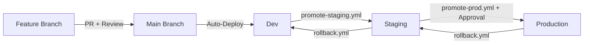

# 🏗 AccessWeaver Infrastructure as Code

Infrastructure AWS pour AccessWeaver - Système d'autorisation enterprise open-source

## 🎯 Vue d'ensemble

Ce repository contient l'infrastructure Terraform pour déployer AccessWeaver sur AWS avec :
- **Architecture haute disponibilité** sur multiple AZ
- **Multi-environnements** (dev/staging/prod) avec isolation complète
- **Sécurité enterprise** (VPC, Security Groups, encryption at-rest/in-transit)
- **Monitoring et observabilité** intégrés
- **Auto-scaling** et résilience

## 🏗 Architecture Cible

```
Internet
    ↓
┌────────────────────────────────────────────┐
│            Application Load Balancer        │ ← SSL Termination
│              (Multi-AZ)                    │
└─────────────────┬──────────────────────────┘
                  │
    ┌─────────────┼───────────┐
    │             │           │
┌───▼───┐    ┌───▼───┐     ┌──▼──┐
│OPAL   │    │ PDP   │     │ PAP │  ← ECS Fargate Services
│Server │    │+OPA   │     │ UI  │    (Auto-scaling)
└───────┘    └───────┘     └─────┘
                  │
    ┌─────────────┼─────────────┐
    │             │             │
┌───▼───────┐              ┌────▼────┐
│PostgreSQL │              │ Redis   │  ← Managed Services
│(Multi-AZ) │              │Cluster  │    (High Availability)
└───────────┘              └─────────┘
```

## 💰 Coûts Estimés

| Environment | Coût/mois | Configuration |
|-------------|-----------|---------------|
| **Dev**     | ~$80      | Single AZ, t3.micro instances |
| **Staging** | ~$150     | Multi-AZ, t3.small instances |
| **Prod**    | ~$300     | Multi-AZ, optimized instances + backup |

## 🚀 Quick Start

### Prérequis
```bash
# Installer les outils requis
brew install terraform awscli jq gh
aws configure  # Configurer vos credentials AWS
gh auth login  # Configurer GitHub CLI

# Vérifier les versions
terraform --version  # >= 1.6.0
aws --version        # >= 2.0
java -version        # >= 21 (pour les tests locaux)
```

### Configuration des Secrets GitHub

Pour que les workflows CI/CD fonctionnent correctement, vous devez configurer les secrets GitHub suivants :

1. **AWS_ROLE_TO_ASSUME** : ARN du rôle IAM à assumer par GitHub Actions
2. **SLACK_WEBHOOK_URL** : URL du webhook Slack pour les notifications

Consultez le guide détaillé dans [.github/GITHUB_SECRETS_SETUP.md](.github/GITHUB_SECRETS_SETUP.md) pour les instructions complètes.

### Déploiement Rapide (Dev)
```bash
# 1. Cloner le repository
git clone https://github.com/accessweaver/aw-infrastructure-as-code.git
cd aw-infrastructure-as-code

# 2. Initialiser le backend S3/DynamoDB
make setup-backend ENV=dev

# 3. Configurer les variables (copier et adapter)
cp environments/dev/terraform.tfvars.example environments/dev/terraform.tfvars
# Éditer terraform.tfvars avec vos valeurs

# 4. Déployer l'infrastructure
make deploy ENV=dev

# 5. Vérifier le déploiement
make validate ENV=dev

# 6. Créer un tag de version
make tag-version  # Entrez la version (ex: v1.0.0)
```

## 📁 Structure du Repository

```
aw-infrastructure-as-code/
├── environments/           # Configurations par environnement
│   ├── dev/               # Développement
│   ├── staging/           # Pre-production
│   └── prod/              # Production
├── modules/               # Modules Terraform réutilisables
│   ├── vpc/              # Virtual Private Cloud
│   ├── ecs/              # Elastic Container Service
│   ├── rds/              # PostgreSQL Database
│   ├── redis/            # ElastiCache Redis
│   ├── alb/              # Application Load Balancer
│   └── monitoring/       # CloudWatch + X-Ray
├── scripts/              # Scripts d'automatisation
└── docs/                 # Documentation détaillée
```

## 🔧 Commandes Principales

```bash
# Opérations sur l'infrastructure
make plan ENV=dev        # 📋 Voir les changements prévus
make apply ENV=dev       # 🚀 Appliquer les changements
make destroy ENV=dev     # 💥 Détruire l'environnement
make validate ENV=dev    # ✅ Valider la configuration

# Utilitaires
make fmt                 # 🎨 Formatter le code Terraform
make security-scan       # 🛡 Scanner la sécurité (tfsec)
make costs ENV=dev       # 💰 Estimer les coûts
make outputs ENV=dev     # 📊 Afficher les outputs Terraform
```

## 🛡 Sécurité

### Mesures Implémentées
- ✅ **VPC isolé** avec subnets public/privé sur 2 AZ minimum
- ✅ **Security Groups** restrictifs (principe du moindre privilège)
- ✅ **Encryption at-rest** : RDS, EBS, S3 avec KMS
- ✅ **Encryption in-transit** : TLS 1.3 pour tous les services
- ✅ **Secrets management** : AWS Systems Manager Parameter Store
- ✅ **IAM roles** : Permissions minimales par service
- ✅ **Network ACLs** : Firewall au niveau subnet
- ✅ **Flow logs** : Monitoring du trafic réseau

### Compliance
- **RGPD** : Encryption, audit logs, data residency EU
- **SOC2** : Access controls, monitoring, incident response
- **ISO27001** : Security controls, risk management

## 📊 Monitoring & Observabilité

### Métriques Collectées
- **Application** : Latence, throughput, erreurs par service
- **Infrastructure** : CPU, mémoire, réseau, disque
- **Business** : Nombre de décisions/sec, cache hit rate
- **Sécurité** : Tentatives d'accès, anomalies

### Dashboards
- **Grafana** : Métriques temps réel + alerting
- **CloudWatch** : Logs centralisés + métriques AWS
- **X-Ray** : Tracing distribué des requêtes

## 🚨 Gestion d'Incidents

### Alertes Automatiques
```yaml
Alertes configurées:
  - Latence > 100ms (P95)
  - Taux d'erreur > 1%
  - CPU > 80% sustained
  - Mémoire > 85%
  - Disk > 80%
  - Database connections > 80%
```

### Playbooks
- [Incident Response](docs/incident-response.md)
- [Disaster Recovery](docs/disaster-recovery.md)
- [Scaling Procedures](docs/scaling.md)

## 🔄 CI/CD Integration

### GitHub Actions Workflows

#### Validation et Planning
- **terraform-validate.yml** : Validation du code Terraform, linting et scan de sécurité
- **terraform-plan.yml** : Génère un plan Terraform pour chaque environnement lors des PRs et publie le résultat dans les commentaires

#### Déploiement
- **terraform-apply.yml** : Applique automatiquement les changements à l'environnement dev après merge sur main
- **promote-staging.yml** : Promeut une version spécifique vers l'environnement staging
- **promote-prod.yml** : Promeut une version vers production avec gate d'approbation
- **rollback.yml** : Rollback d'urgence vers une version antérieure stable

#### Notifications
- Intégration Slack pour chaque étape du pipeline
- Notifications d'erreurs et alertes en cas d'échec
- Rapports de déploiement et liens vers les dashboards

### Configuration requise

1. **Secrets GitHub**
   - `AWS_ROLE_TO_ASSUME` : Rôle IAM avec permissions Terraform
   - `SLACK_WEBHOOK_URL` : Pour les notifications

2. **Environnements GitHub**
   - `dev` : Déploiement automatique
   - `staging` : Approbation optionnelle
   - `prod-plan` et `prod` : Approbation obligatoire

3. **Authentification AWS**
   - Configuration OIDC entre GitHub et AWS
   - Permissions IAM appropriées

Voir [.github/GITHUB_SECRETS_SETUP.md](.github/GITHUB_SECRETS_SETUP.md) pour les instructions détaillées.

### Process de Promotion Multi-Environnements



### Commandes Makefile pour CI/CD

```bash
# Commandes de promotion
make tag-version                 # 🏷️ Créer un nouveau tag de version Git
make promote-staging            # 🚀 Promouvoir une version vers staging
make promote-prod               # 🚀 Promouvoir une version vers production

# Rollback d'urgence
make rollback                   # ⏮️ Rollback d'un environnement
```

> **Note**: Ces commandes utilisent GitHub CLI (`gh`) pour déclencher les workflows GitHub Actions. Assurez-vous d'avoir configuré `gh auth login` et d'avoir les permissions nécessaires sur le repository.

## 📚 Documentation

- 📋 [Architecture détaillée](docs/architecture.md)
- 🚀 [Guide de déploiement](docs/deployment-guide.md)
- 🔧 [Dépannage](docs/troubleshooting.md)
- 💰 [Optimisation des coûts](docs/cost-optimization.md)
- 🛡 [Guide de sécurité](docs/security-guide.md)
- 📊 [Monitoring](docs/monitoring.md)

## 🤝 Contribution

### Workflow
1. **Fork** le repository
2. **Créer** une feature branch
3. **Tester** localement avec `make validate`
4. **Soumettre** une Pull Request

### Standards
- Code **formaté** avec `terraform fmt`
- **Tests** passants
- **Documentation** mise à jour
- **Security scan** clean

## 📞 Support

- **Issues** : [GitHub Issues](https://github.com/accessweaver/aw-infrastructure-as-code/issues)
- **Discussions** : [GitHub Discussions](https://github.com/accessweaver/aw-infrastructure-as-code/discussions)
- **Documentation** : [Wiki](https://github.com/accessweaver/aw-infrastructure-as-code/wiki)
- **Slack** : #infrastructure channel

## 📄 License

Ce projet est sous licence **Apache 2.0** - voir le fichier [LICENSE](LICENSE) pour plus de détails.

---

**Version** : 1.0  
**Dernière mise à jour** : Mai 2025  
**Mainteneur** : Équipe Infrastructure AccessWeaver