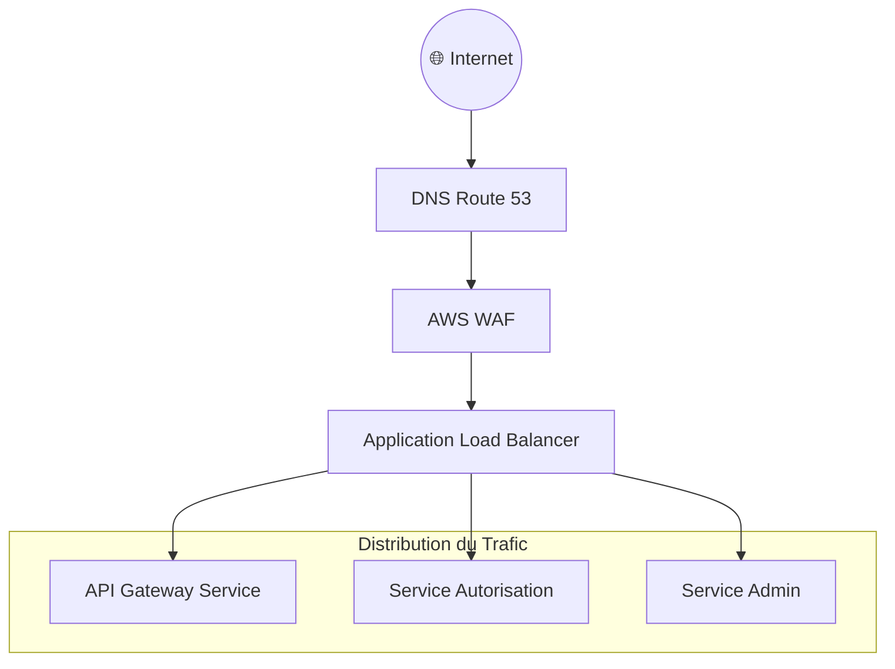

# 🔁 Stratégie de Load Balancing d'AccessWeaver

## 🕋 Vue d'Ensemble

La stratégie de load balancing d'AccessWeaver repose sur un Application Load Balancer (ALB) AWS comme point d'entrée principal du système. Cette approche garantit une distribution optimale du trafic vers les microservices tout en offrant des fonctionnalités avancées de routage, sécurité et monitoring.



## 📈 Composants Principaux

### 🌐 Application Load Balancer

L'ALB d'AccessWeaver est déployé avec une configuration adaptée à chaque environnement :

- **Type** : Internet-facing dans des sous-réseaux publics multi-AZ
- **TLS** : Terminaison SSL avec AWS Certificate Manager
- **Mode** : Mode HTTP/2 activé pour optimiser les performances
- **Sticky Sessions** : Désactivées (architecture stateless avec JWT)

### 🗜️ Target Groups

Target groups dédiés pour chaque service public :

| Service | Port | Path Pattern | Health Check |
|---------|------|--------------|-------------|
| api-gateway | 8080 | `/api/*` | `/actuator/health` |
| admin-ui | 8080 | `/admin/*` | `/actuator/health` |
| auth-service | 8080 | `/auth/*` | `/actuator/health` |

### 🔍 Health Checks 

Config. optimisée pour Spring Boot :

- **Path** : `/actuator/health` (endpoint standard Spring Boot)
- **Interval** : 15 secondes (production), 30 secondes (dev/staging)
- **Timeout** : 5 secondes
- **Healthy Threshold** : 2 vérifications consécutives
- **Unhealthy Threshold** : 2 échecs (prod), 3 échecs (dev/staging)
- **Success Codes** : 200 OK

### Deregistration Delay

Délai de 30 secondes avant de retirer une cible du load balancer, permettant de :
- Finaliser les requêtes en cours
- Éviter les interruptions de service lors des déploiements
- Gérer la terminaison gracieuse des containers

## 🛠️ Routage et Distribution

### 🔗 Path-based Routing

Routage intelligent basé sur les chemins d'URL :

```
/api/v1/* → API Gateway Service
/admin/* → Admin Service
/auth/* → Auth Service
/actuator/* → Service correspondant
```

Cette approche permet d'exposer tous les services via une seule URL de base tout en dirigeant le trafic vers le bon microservice.

### 🕰️ Algorithme de Load Balancing

- **Algorithme** : Round-robin (distribution équitable par défaut)
- **Croisement de Zone** : Activé en production et staging pour résilience maximale
- **Circuit Breaker** : Exclusion automatique des instances en échec

### 🕒 Connection Draining

Le drainage de connexion assure une transition fluide lors des déploiements :

- **Délai** : 30 secondes en production
- **Comportement** : Les nouvelles requêtes sont redirigées vers des instances saines, tandis que les connexions existantes terminent normalement

## 🔑 Sécurité et SSL

### 🔒 Terminaison SSL

La terminaison SSL est effectuée au niveau de l'ALB :

- **Certificats** : Gérés via AWS Certificate Manager (ACM)
- **Renouvellement** : Automatique (validité 13 mois)
- **Protocols** : TLS 1.2 et 1.3 uniquement
- **Ciphers** : Sélection moderne recommandée par AWS

### 🔞 Redirection HTTP vers HTTPS

Redirection automatique de tout le trafic HTTP vers HTTPS :

- **Code** : 301 (redirection permanente)
- **Port** : 443
- **Activation** : Forcée en staging/production, configurable en développement

### 💡 Sécurité Headers

En-têtes de sécurité injectés automatiquement :

- **Strict-Transport-Security** (HSTS)
- **X-Content-Type-Options**
- **X-Frame-Options**
- **Content-Security-Policy**

## 📃 Logging et Monitoring

### 📄 Access Logs

Logs d'accès envoyés vers S3 avec lifecycle policy :

- **Format** : Standard ELB logs
- **Rétention** :
  - Développement : Optionnels
  - Staging : 30 jours avec transition vers S3 IA après 30 jours
  - Production : 90+ jours avec transition vers Glacier après 90 jours

### 🔎 Metrics CloudWatch

Principales métriques surveillées :

- **ActiveConnectionCount** : Connexions simultanées
- **HTTPCode_ELB_4XX/5XX** : Erreurs côté client et serveur
- **TargetResponseTime** : Latence de réponse
- **HealthyHostCount/UnhealthyHostCount** : État des cibles
- **RequestCount** : Volume de trafic

## 🌟 Configurations Spécifiques par Environnement

| Configuration | Développement | Staging | Production |
|--------------|---------------|---------|------------|
| Délai Health Check | 30s | 30s | 15s |
| SSL Policy | ELBSecurityPolicy-2016-08 | ELBSecurityPolicy-TLS-1-2 | ELBSecurityPolicy-FS-1-2 |
| WAF | Désactivé | Standard | Renforcé |
| Logging | Minimal | Standard | Complet |
| Circuit Breaker | Permissif | Standard | Strict |
| Cross-Zone LB | Désactivé | Activé | Activé |

## 📈 Capacité et Scaling

L'ALB s'adapte automatiquement à la charge :

- **Scaling automatique** : Jusqu'à 100,000 requêtes par seconde
- **Latence** : Optimisé pour maintenir <100ms d'overhead
- **Connexions** : Jusqu'à 3,000 connexions simultanées par cible

## 🐛 Troubleshooting Courant

- **503 Service Unavailable** : Vérifier les health checks et déploiements en cours
- **504 Gateway Timeout** : Vérifier les timeouts et la performance des services
- **400/401/403** : Problème d'authentification ou autorisation
- **Target deregistration delay** : Ajuster selon comportement observé

## 🚀 Points d'Amélioration Future

- Intégration avec AWS Shield Advanced pour protection DDoS renforcée
- Configuration de Lambda@Edge pour traitement en périphérie
- Support IPv6 dual-stack
- Configuration d'une solution de Blue/Green déploiement au niveau ALB