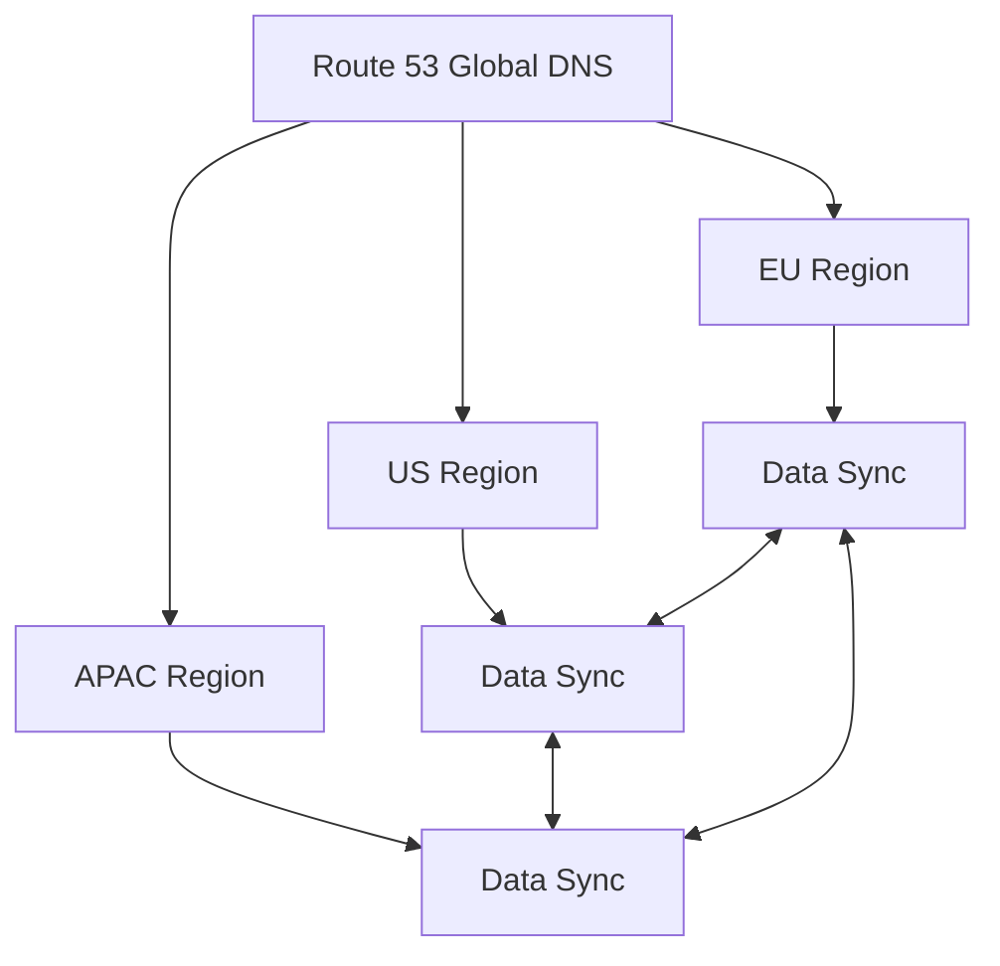

# 🌎 Déploiement Multi-Régions d'AccessWeaver

## 🌏 Vue d'Ensemble

Le déploiement multi-régions d'AccessWeaver permet aux entreprises d'opérer leurs systèmes d'autorisation avec une résilience globale et une conformité aux règles de souveraineté des données. Cette architecture est particulièrement adaptée aux organisations internationales ou avec des exigences strictes en termes de reprise après sinistre.

## 🚦 Modes de Déploiement Multi-Régions

AccessWeaver supporte trois stratégies de déploiement multi-régions :

### 🔄 Active-Passive

- **Configuration** : Une région principale active, une ou plusieurs régions secondaires passives
- **Basculement** : Automatique via Route 53 health checks (RTO ~5 min)
- **Synchronisation** : Réplication asynchrone des données (RPO ~5 min)
- **Cas d'usage** : Solution économique pour DR (Disaster Recovery)

### 🔁 Active-Active

- **Configuration** : Toutes les régions actives simultanément
- **Routage** : Latence-based ou geo-proximity via Route 53
- **Synchronisation** : Réplication bidirectionnelle (quasi-synchrone)
- **Cas d'usage** : Applications globales à haute disponibilité

### 🏗️ Regional Isolation

- **Configuration** : Régions indépendantes dédiées à des zones géographiques
- **Isolation** : Données strictement continées dans chaque région
- **Synchronisation** : Méta-données uniquement (pas de données clients)
- **Cas d'usage** : Conformité RGPD et législations locales

## 💻 Composants Techniques

### 📍 Route 53 pour Routage Global

- **Health Checks** : Vérification des endpoints critiques toutes les 10s
- **Failover Policies** : Basculement automatique en cas d'indisponibilité
- **Latency-Based Routing** : Acheminement automatique vers la région la plus proche
- **Geo-Routing** : Diriger les utilisateurs vers des régions spécifiques

### 💾 Stratégies de Synchronisation de Données

#### Base de Données

- **PostgreSQL** : Utilisation de AWS Database Migration Service (DMS)
  - Réplication continue avec latence ~1s
  - Support des Change Data Capture (CDC)
  - Résolution automatique des conflits (timestamps)

- **Option Alternative** : PostgreSQL Logical Replication
  - Configuration native pour multi-master replication
  - Modification du schéma pour identifier région source

#### Cache Redis

- **ElastiCache Global Datastore** :
  - Réplication cross-region avec failover automatique
  - Latence <1s pour la synchronisation

- **Alternative** : Réplication manuelle avec Redis Enterprise
  - Conflict-Free Replicated Data Types (CRDTs)
  - Résolution de conflits automatique

### 📰 Stratégie de Déploiement

- **Terraform Workspaces** : Un workspace par région
- **CI/CD Multi-Pipeline** : Déploiement parallèle ou séquentiel
- **Configuration Management** : Paramètres spécifiques par région via SSM

## 🔐 Sécurité et Conformité

### 🔒 Chiffrement Межrégional

- **In-Transit** : TLS 1.3 pour toutes communications inter-régions
- **KMS Cross-Region** : Clés dédiées par région
- **VPC Peering** : Sécurisé entre régions pour trafic privé

### 📓 Souveraineté des Données

- **Data Residency** : Contrôle explicite de localisation
- **Regional Buckets** : S3 et backups localisés par région
- **Tenant Routing** : Association tenant-région configurable

## 👁️ Observabilité Multi-Régions

### 📈 CloudWatch Cross-Region

- **Dashboards unifiés** : Vue globale de toutes régions
- **Alarmes composites** : Détection problèmes multi-régions
- **Metrics Math** : Comparaison performances entre régions

### 📑 Logs Centralisés

- **Central Logging Region** : Agrégation dans une région principale
- **Kinesis/Lambda** : Routage et transformation des logs
- **Retention** : Conservation selon règles par région

## 📊 Performance et Latence

L'impact du déploiement multi-régions sur les performances :

| Scénario | Latence API | RPO | RTO |
|-----------|------------|-----|-----|
| Single-Region | ~50ms | N/A | N/A |
| Active-Passive | ~50ms | ~5 min | ~5 min |
| Active-Active | ~80ms | <1 min | ~0 min |
| Regional Isolation | ~50ms | N/A | N/A |

## 💳 Considérations de Coût

- **Surcoût moyen** : 80-120% par région additionnelle
- **Frais de transfert** : Considérable pour synchronisation (DMS, Redis)
- **Optimisation** : Réplication selective des données critiques uniquement

## 🚧 Mise en Œuvre Progressive

AccessWeaver recommande une approche par étapes :

1. **Phase 1** : Déploiement Active-Passive pour DR
   - Infrastructure minimale réplique
   - Tests de basculement réguliers

2. **Phase 2** : Migration vers Active-Active
   - Ajout capacité complète dans région secondaire
   - Configuration réplication bidirectionnelle

3. **Phase 3** : Optimisation globale
   - Routage intelligent par tenant/utilisateur
   - Performance tuning des réplications

## 📈 Recommandations pour AccessWeaver

- **Standard Enterprise** : Active-Passive (EU-West-1 → EU-Central-1)
  - Solution équilibrée rapport coût/résilience
  - RPO/RTO ~5 minutes

- **Premium Enterprise** : Active-Active (EU + US)
  - Haute disponibilité distribuée globalement
  - Performance optimale par région géographique

- **Regulated Industries** : Regional Isolation
  - Conformité RGPD stricte
  - Souveraineté des données garantie