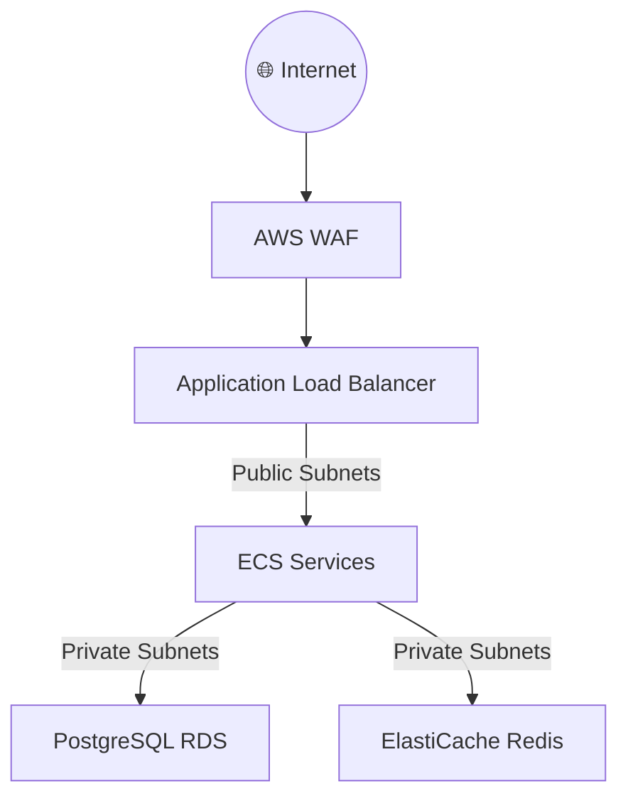

# 🌐 Architecture Réseau d'AccessWeaver

## 📡 Vue d'Ensemble du Réseau

L'infrastructure réseau d'AccessWeaver est conçue pour offrir sécurité, haute disponibilité et isolation optimale des services. Basée sur AWS VPC (Virtual Private Cloud), notre architecture réseau garantit un environnement robuste pour notre système d'autorisation multi-tenant.

## 🏗️ Composants Principaux

### 🔄 VPC et Subnets

Notre VPC est segmenté en zones de disponibilité multiples pour garantir la résilience :

- **Subnets Publics** : Hébergent les Application Load Balancers et les points d'entrée exposés
- **Subnets Privés** : Contiennent les services ECS Fargate, bases de données RDS et ElastiCache
- **CIDR Block** : Allocation `/16` par défaut, offrant jusqu'à 65,536 adresses IP

### 🌊 Routage et Connectivité

- **Internet Gateway** : Point d'entrée/sortie pour le trafic internet
- **NAT Gateways** : Permettent aux services en subnet privé d'accéder à internet
- **Route Tables** :
  - Tables publiques avec routes vers l'Internet Gateway
  - Tables privées avec routes vers les NAT Gateways

### 🚧 Sécurité Réseau

- **Network ACLs** : Filtrage du trafic au niveau subnet (stateless)
  - ACLs publiques : autorisent HTTP/HTTPS entrant + trafic éphémère
  - ACLs privées : trafic limité au CIDR du VPC
- **Flow Logs** : Capture du trafic réseau pour audit et monitoring
  - Stockés dans CloudWatch avec rétention configurable

## 🔄 Architecture Multi-AZ

AccessWeaver est déployé sur plusieurs zones de disponibilité AWS pour assurer la haute disponibilité :

- Répartition des services sur au moins 2 AZ par défaut
- Distribution automatique du trafic via ALB entre les AZ actives
- Récupération automatique en cas de défaillance d'une AZ

## 🛠️ Configurations Spéciales

### 🔒 Sécurité Avancée

- **AWS PrivateLink** (optionnel) : Pour la connexion sécurisée aux services AWS sans exposition internet
- **VPC Endpoints** : Accès privé aux services AWS comme S3, ECR et DynamoDB
- **VPC Peering** (optionnel) : Pour l'interconnexion avec d'autres VPC clients

### 📡 Modes de Déploiement

Notre architecture réseau supporte plusieurs modes de déploiement :

- **Standard** : Déploiement simple avec NAT Gateway partagée
- **Haute Disponibilité** : NAT Gateway dans chaque AZ pour isolation complète
- **Économique** : Option de désactivation des NAT Gateways pour les environnements de développement

## 📊 Dimensionnement

Le module VPC est conçu pour s'adapter à différents scénarios de déploiement :

| Environnement | CIDR VPC    | AZs | Subnets Publics | Subnets Privés |
|---------------|-------------|-----|-----------------|----------------|
| Développement | 10.0.0.0/16 | 2   | 2               | 2              |
| Staging       | 10.1.0.0/16 | 2   | 2               | 2              |
| Production    | 10.2.0.0/16 | 3   | 3               | 3              |

## 🔗 Intégration avec AWS Transit Gateway

Pour les déploiements enterprise impliquant plusieurs VPCs ou connections on-premise, AccessWeaver peut s'intégrer à AWS Transit Gateway pour centraliser la connectivité.

## 🚀 Bonnes Pratiques

- Isolation stricte entre environnements via des VPCs séparés
- Déploiement des services applicatifs uniquement dans les subnets privés
- Activation des Flow Logs pour la conformité et la sécurité
- Utilisation de subnets dédiés pour RDS et ElastiCache