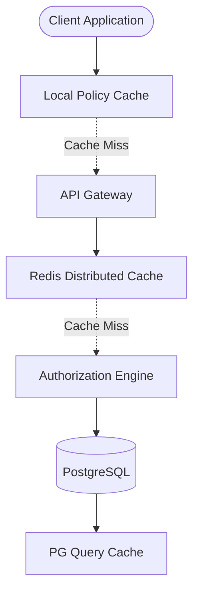

# 🚀 Stratégie de Performance d'AccessWeaver

## 🏖️ Vue d'Ensemble

La stratégie de performance d'AccessWeaver est conçue pour garantir des décisions d'autorisation rapides (<50ms) et une haute disponibilité (>99.9%), essentielles pour un système d'autorisation enterprise. Cette stratégie combine optimisations à plusieurs niveaux, de l'infrastructure AWS jusqu'au code applicatif.



## 📊 Niveaux de Cache

AccessWeaver implémente une stratégie de cache multi-niveaux pour optimiser les performances :

### 🔥 Cache Local (Application)

- **Type** : Cache in-memory avec Caffeine
- **Stockage** : Politiques d'autorisation et décisions récentes
- **TTL** : 60 secondes (configurable)
- **Invalidation** : À la modification des politiques
- **Performance** : <5ms pour les décisions cachées

### 🔊 Cache Distribué (Redis)

Utilisé pour partager le cache entre instances :

- **Implémentation** : ElastiCache Redis en mode cluster
- **Structure** : Hash maps pour policies et décisions
- **TTL** : 5 minutes par défaut (configurable)
- **Canal d'invalidation** : Pub/Sub pour coordonner les instances
- **Performance** : <20ms pour les décisions cachées

### 💾 Cache de Base de Données

- **Query Cache** : Optimisation des requêtes fréquentes
- **Indexes** : Indexation des colonnes fréquemment filtrées
- **Materialized Views** : Pour les rapports et les agrégations complexes
- **Connection Pooling** : HikariCP optimisé pour throughput

## 🌊 Optimisation des API

### 🛠️ Techniques d'Optimisation

- **Response Compression** : GZIP pour réduire le volume de données
- **Batching** : Support des décisions par lots (jusqu'à 100 par requête)
- **Async Processing** : Utilisation de Virtual Threads Java 21
- **Streaming** : Pour les réponses volumineuses

### 🔍 API Check Rapide

Endpoint optimisé pour vérifications d'autorisations critiques :

```http
POST /api/v1/authz/check
Content-Type: application/json

{
  "subject": "user:123",
  "action": "read",
  "resource": "document:456"
}
```

Réponse binaire simple (allow/deny) en <20ms pour 99% des requêtes.

## 🔌 Optimisations Infrastructure

### 💡 ElastiCache Redis

- **Mode** : Cluster avec réplication entre AZs
- **Instance Type** : cache.m5.large (production)
- **Replication** : Multi-AZ avec failover automatique
- **Connexions** : Pooling avec Lettuce client
- **Monitoring** : Métriques critiques sur CloudWatch

### 💻 RDS PostgreSQL

- **Instance Type** : db.m5.large (production)
- **Storage** : gp3 pour IOPS prévisibles
- **Read Replicas** : Pour répartir les requêtes readonly
- **Autovacuum** : Configuration agressive pour éviter bloat
- **Index** : Maintenance régulière et analyse des plans d'exécution

### 🔗 ECS Fargate

- **CPU/Memory** : Allocation optimale basée sur profiling
- **Concurrency** : Horizontal scaling basé sur CPU et requêtes
- **Target Utilization** : 70% pour réserve de capacité

## 🚀 Optimisations Java/Spring Boot

- **JVM** : Paramètres optimisés pour containers
  ```
  -XX:MaxRAMPercentage=75.0 -XX:+UseG1GC -XX:+ExitOnOutOfMemoryError
  ```

- **Spring Boot** : Configuration de production
  ```yaml
  spring:
    main:
      lazy-initialization: false
    jpa:
      properties:
        hibernate.jdbc.batch_size: 50
        hibernate.query.plan_cache_size: 256
    cache:
      caffeine.spec: maximumSize=10000,expireAfterWrite=60s
  server:
    tomcat:
      max-threads: 200
      accept-count: 100
  ```

- **Virtual Threads** : Utilisation pour opérations I/O
  ```java
  @Bean
  public AsyncTaskExecutor applicationTaskExecutor() {
      return new TaskExecutorAdapter(Executors.newVirtualThreadPerTaskExecutor());
  }
  ```

## 📏 Performance par Environnement

| Métrique | Développement | Staging | Production |
|-----------|---------------|---------|------------|
| Latence API | <200ms | <100ms | <50ms |
| Cache Hit Rate | >80% | >90% | >95% |
| Throughput | 100 RPS | 500 RPS | 2000+ RPS |
| Scaling | Manual | Auto (50-70% CPU) | Auto (50-70% CPU) |
| DB Connections | 10-20 | 20-50 | 50-200 |

## 📈 Monitoring et Alertes

### 📄 Métriques Clés

- **Latence** : P50, P90, P99 pour chaque endpoint
- **Cache** : Hit rate, invalidations, taille
- **Database** : Query time, connection usage, locks
- **JVM** : Memory usage, GC pauses, thread count
- **Redis** : Memory usage, hit rate, evictions

### 🔔 Alertes Proactives

- **Latence P99 >100ms** : Dégradation de performance
- **Cache Hit Rate <90%** : Efficacité cache diminuée
- **Database CPU >80%** : Limitation potentielle
- **Memory Usage >85%** : Risque OOM

## 🚨 Gestion des Pics de Charge

- **Rate Limiting** : Par tenant et par IP
- **Circuit Breakers** : Protection services critiques
- **Queue Buffering** : Pour les opérations asynchrones
- **Graceful Degradation** : Modes de secours pour haute charge

## 🔍 Testing Performance

- **Load Testing** : JMeter avec scénarios réalistes
- **Profiling** : YourKit/VisualVM pour analyse code
- **Chaos Testing** : Simulations d'échecs pour robustesse
- **Benchmarks** : Comparaison entre versions