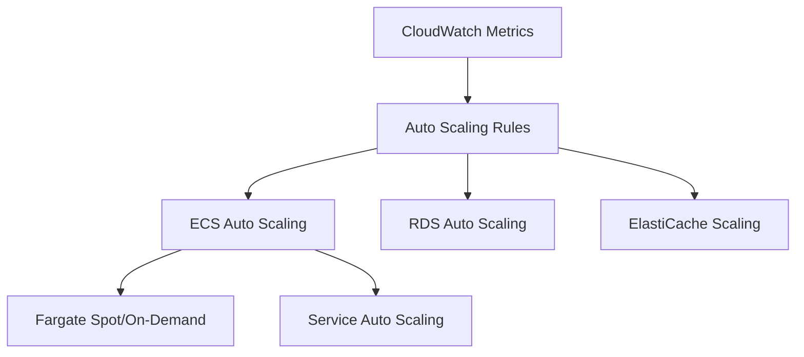

# 📈 Stratégie d'Auto-Scaling d'AccessWeaver

## 🔍 Vue d'Ensemble

L'architecture d'auto-scaling d'AccessWeaver garantit que le système s'adapte dynamiquement aux variations de charge tout en optimisant les coûts. Cette stratégie permet de maintenir des performances constantes quel que soit le nombre d'utilisateurs ou de décisions d'autorisation à traiter.



## 📀 Principes de Scaling

L'auto-scaling d'AccessWeaver suit plusieurs principes :

- **Scaling prédictif** : Utilisation des patterns historiques pour anticiper les pics
- **Économie de coûts** : Utilisation optimale des ressources selon la charge
- **Résilience** : Capacité à absorber les pics soudains de trafic
- **Multi-dimensions** : Scaling horizontal et vertical selon les besoins

## 📊 Scaling des Services

### 📟 Scaling ECS (Compute)

Le scaling des services ECS s'effectue à deux niveaux :

#### Service Auto Scaling

- **Métriques de déclenchement** :
  - CPU Utilization (target: 70%)
  - Memory Utilization (target: 80%)
  - Request Count Per Target (target: ~800 req/min)

- **Configuration** :
  ```hcl
  scale_target_capacity = 70
  scale_in_cooldown     = 300
  scale_out_cooldown    = 60
  ```

- **Limites** :
  - Minimum: 2 tâches (haute disponibilité multi-AZ)
  - Maximum: configurable par environnement

#### Capacity Providers

- **Fargate** : Compute à la demande, sans gestion de serveurs
- **Mix On-Demand/Spot** : Pour optimisation coûts (production)
  - 70% Fargate On-Demand (services critiques)
  - 30% Fargate Spot (traitements batch, analytics)

### 💾 Scaling Base de Données

#### RDS PostgreSQL Scaling

- **Vertical** : Ajustement automatique des types d'instances
  - Environnements dev/staging: `db.t3.medium` → `db.t3.large`
  - Production: `db.m5.large` → `db.m5.2xlarge`

- **Storage Auto Scaling** : 
  - Augmentation automatique (max 1TB)
  - Threshold: 85% d'utilisation

- **Read Replicas** : Ajout automatique pour charge en lecture
  - Trigger: CPU > 75% pendant 5 minutes
  - Max: 3 réplicas en production

### 🔊 Scaling Redis Cache

#### ElastiCache Auto Scaling

- **Shard Scaling** :
  - Basé sur memory utilization (threshold: 75%)
  - Ajoute/supprime automatiquement des shards

- **Node Type Scaling** :
  - Scale-up lors des pics de charge importants
  - Types: `cache.t3.medium` → `cache.m5.large` → `cache.m5.xlarge`

- **Replicas Auto Scaling** :
  - Basé sur ReplicaLag et EngineCPU
  - Minimum: 1 réplica par shard (HA)

## 📊 Patterns de Scaling par Service

Les services AccessWeaver ont des caractéristiques différentes en termes de scaling :

| Service | Scaling Priority | CPU-Bound | Memory-Bound | I/O-Bound |
|---------|-----------------|-----------|-------------|----------|
| API Gateway | High | Medium | Low | High |
| Auth Service | High | High | Medium | Medium |
| Policy Service | Medium | High | High | Medium |
| Admin UI | Low | Low | Medium | Low |
| Analytics | Low | High | High | High |

## 💸 Optimisation des Coûts

### 📊 Stratégies d'Économie

- **Auto-Stop pour environnements non-prod** :
  - Désactivation automatique la nuit/weekends
  - Réactivable via AWS Lambda Scheduler

- **Reservation Capacity** :
  - Pour les services à charge stable
  - Savings Plans pour Fargate et RDS

- **Spot Instances** :
  - Pour workloads non-critiques
  - Failover vers On-Demand configuré

- **Instance Right-sizing** :
  - Analyse régulière via CloudWatch metrics
  - Downsizing automatique si surprovisionnement

## 📊 Capacity Planning

### 📈 Méthodologie

- **Monitoring usage patterns** : Données historiques sur 30 jours
- **Tenant growth projections** : Modèle prévisionnel par tenant
- **Performance budgets** : Seuils de latence à maintenir

### 📊 Benchmarks Par Tenant

Chaque tenant a un profil de consommation modélisé :

- **Petit tenant** (~100 utilisateurs)
  - 50-100 requêtes/seconde en pic
  - 0.5 vCPU, 1GB RAM par service

- **Tenant moyen** (~1,000 utilisateurs)
  - 100-500 requêtes/seconde
  - 1 vCPU, 2GB RAM par service

- **Grand tenant** (5,000+ utilisateurs)
  - 500-2,000 requêtes/seconde
  - 2-4 vCPU, 4-8GB RAM par service

## 📚 Observabilité et Alertes

### 📑 Métriques de Scaling

- **Service Metrics** :
  - CPUUtilization, MemoryUtilization
  - RequestCountPerTarget
  - 5XXErrors, 4XXErrors

- **Database Metrics** :
  - DatabaseConnections
  - ReadIOPS, WriteIOPS
  - FreeStorageSpace

- **Redis Metrics** :
  - CPUUtilization
  - DatabaseMemoryUsagePercentage
  - CurrConnections

### 💠 Dashboards

Dashboards CloudWatch dédiés au scaling :

- **Capacity Dashboard** : Vue d'ensemble utilisation vs capacité
- **Scaling Events** : Historique des événements d'auto-scaling
- **Cost vs Performance** : Visualisation coûts vs performances

## 💻 Configuration par Environnement

### 🌡️ Environnement de Développement

- **Scaling Strategy** : Minimal, principalement manuel
- **Capacity** : Fixée à 2 instances par service
- **Cost Controls** : Auto-stop nights/weekends

### 🌏 Environnement de Staging

- **Scaling Strategy** : Auto-scaling actif mais restreint
- **Scales Based On** : CPU (70%), Memory (80%)
- **Min/Max Capacity** : 2/5 instances

### 🌐 Environnement de Production

- **Scaling Strategy** : Full auto-scaling avec prédictif
- **Scales Based On** : Multi-metrics (CPU, Memory, Requests, Custom)
- **Target Tracking** : Algorithme avancé
- **Min/Max Capacity** : 3/20 instances (par service)

## 🚀 Scaling Avancé et Évolution

- **Scaling prédictif AWS** : Anticipation des pics
- **Serverless portions** : Lambda pour certains traitements
- **Cross-region scaling** : Répartition de charge entre régions
- **Database sharding** : Pour très grands tenants (future)