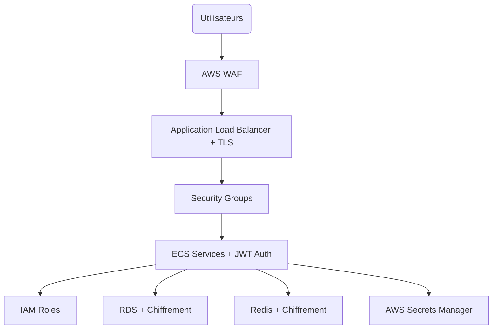

# 🔒 Architecture de Sécurité d'AccessWeaver

## 🔐 Vue d'Ensemble Sécurité

L'architecture de sécurité d'AccessWeaver est conçue selon le principe de défense en profondeur avec plusieurs couches de protection pour garantir l'intégrité d'un système d'autorisation enterprise. Tous les aspects sécuritaires sont intégrés dès la conception (*security-by-design*) et non ajoutés après coup.

## 🏗️ Composants Sécuritaires Principaux

### 🛡️ Protection Périmétrique

- **AWS WAF** : Protection contre les attaques web
  - Protection OWASP Top 10 (SQLi, XSS, etc.)
  - Rate limiting pour prévenir les attaques DDoS
  - Filtrage géographique configurable
  - Rules spécifiques pour APIs REST

- **Application Load Balancer** : Sécurisation des points d'entrée
  - Terminaison TLS avec ciphers modernes
  - Redirection HTTP vers HTTPS forcée
  - Certificats AWS Certificate Manager avec renouvellement automatique
  - Access logs pour audit complet

### 🔗 Segmentation Réseau

- **Security Groups** : Micro-segmentation du trafic
  - Règles restrictives par service
  - Principe du moindre privilège
  - Séparation claire front/API/data

- **Network ACLs** : Contrôle au niveau subnet
  - Protection stateless complémentaire
  - Blocage des ports non essentiels
  - Isolation des subnets par fonction

- **VPC Flow Logs** : Surveillance du trafic réseau
  - Détection d'anomalies et d'intrusions
  - Audit pour conformité réglementaire
  - Intégration CloudWatch pour alertes

### 🔑 Gestion des Identités et Accès

- **IAM** : Contrôle d'accès granulaire
  - Rôles par service avec permissions minimales
  - Rotations automatiques des credentials
  - Politiques restrictives basées sur les ressources

- **Service Mesh** : Authentification service-to-service
  - Communication chiffrée entre microservices
  - Authentification mutuelle TLS
  - Contrôles d'accès basés sur l'identité du service

### 🗳️ Protection des Données

- **Chiffrement en Transit**
  - TLS 1.2+ pour toutes les communications
  - VPC Traffic Mirroring pour inspection
  - Tunnels sécurisés pour accès administrateur

- **Chiffrement au Repos**
  - RDS avec chiffrement AWS KMS
  - ElastiCache Redis avec encryption-at-rest
  - S3 avec Server-Side Encryption

- **Secrets Management**
  - AWS Secrets Manager pour credentials
  - Rotation automatique des secrets
  - Intégration avec IAM pour contrôle d'accès

## 🔐 Multi-tenant Security

AccessWeaver étant une solution multi-tenant, plusieurs mécanismes garantissent l'isolation entre clients :

- **Row-Level Security PostgreSQL**
  - Isolation des données par tenant au niveau BD
  - Filtrage automatique par l'ORM
  - Vérification d'appartenance au tenant à chaque requête

- **Namespaces Redis Isolés**
  - Clés préfixées par tenant
  - Contrôle d'accès par namespace

- **JWT avec Claims Tenant**
  - Tokens incluant l'identifiant tenant
  - Validation tenant à chaque requête API
  - Segregation des sessions par tenant

## 💾 Sécurité des Déploiements

- **Immutable Infrastructure**
  - Containers ECS sans état
  - Infrastructure-as-Code vérifiée
  - Provisioning automatisé et auditable

- **CI/CD Sécurisé**
  - Scanning de vulnérabilités dans pipeline
  - Tests de sécurité automatisés
  - Vérification des dépendances

- **Blue/Green Deployments**
  - Mise à jour sans interruption
  - Rollback rapide en cas de problème

## 🗜️ Détection et Réponse

- **Application Monitoring**
  - Métriques de sécurité en temps réel
  - Alertes sur comportements anormaux
  - Détection d'intrusion basée sur pattern

- **CloudTrail & CloudWatch**
  - Audit de toutes les actions AWS
  - Rétention des logs conforme RGPD
  - Intégration SIEM possible

- **Disaster Recovery**
  - Plans de reprise documentés
  - Backups chiffrés multi-régions
  - Tests de restauration réguliers

## 🌐 Configurations Spécifiques par Environnement

| Fonctionnalité | Développement | Staging | Production |
|----------------|---------------|---------|------------|
| WAF | Basique | Standard | Renforcé |
| HTTPS Only | Optionnel | Requis | Requis |
| Flow Logs | Désactivés | 30 jours | 90+ jours |
| KMS Rotation | Manuelle | Auto (90j) | Auto (30j) |
| IAM Access | Développeurs | Restreint | Très limité |

## 📚 Conformité Réglementaire

L'architecture de sécurité d'AccessWeaver est conçue pour faciliter la conformité avec :

- **RGPD/GDPR** : Protection des données personnelles
- **SOC2** : Contrôles de sécurité, disponibilité et confidentialité
- **ISO27001** : Framework de gestion de la sécurité de l'information
- **PCI-DSS** : Si traitement de données de paiement (optionnel)

## 🚀 Bonnes Pratiques Opérationnelles

- Revue régulière des configurations de sécurité
- Rotation des secrets et credentials
- Patching systématique des vulnérabilités
- Tests de pénétration annuels
- Formation continue des équipes aux bonnes pratiques