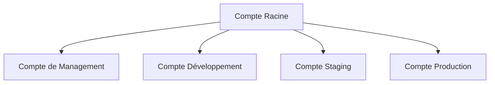

# ☁️ Configuration du Compte AWS pour AccessWeaver

Guide détaillé pour configurer votre compte AWS avant le déploiement d'AccessWeaver.

---

## 📚 Table des Matières

- [Organisation du compte AWS](#organisation-du-compte-aws)
- [IAM - Gestion des identités](#iam---gestion-des-identités)
- [Budgets et Alertes](#budgets-et-alertes)
- [Sécurisation du Compte](#sécurisation-du-compte)
- [Services AWS Requis](#services-aws-requis)
- [Quotas de Service](#quotas-de-service)

---

## 🌐 Organisation du Compte AWS

### **Structure Recommandée**

Pour une isolation optimale et une gestion des coûts efficace, nous recommandons la structure suivante :



### **Organizations**

1. **Création d'AWS Organizations**
   - Se connecter à la console AWS avec le compte racine
   - Accéder à AWS Organizations et activer
   - Créer une Unité Organisationnelle (OU) par environnement

2. **Politique de Service Control (SCP)**
   - Appliquer les politiques pour restreindre l'accès aux services non nécessaires
   - Bloquer la suppression des ressources critiques en production

   Exemple de SCP pour restreindre les régions :
   ```json
   {
     "Version": "2012-10-17",
     "Statement": [
       {
         "Sid": "LimitRegions",
         "Effect": "Deny",
         "Action": "*",
         "Resource": "*",
         "Condition": {
           "StringNotEquals": {
             "aws:RequestedRegion": ["eu-west-1", "eu-west-3", "eu-central-1"]
           }
         }
       }
     ]
   }
   ```

---

## 🔑 IAM - Gestion des Identités

### **Utilisateurs et Groupes**

1. **Création des groupes IAM**

   ```
   ├── AccessWeaver-Admins      # Accès complet à l'infrastructure AccessWeaver
   ├── AccessWeaver-DevOps     # Déploiement et maintenance
   ├── AccessWeaver-Developers # Accès en lecture seule + développement
   └── AccessWeaver-ReadOnly   # Surveillance et audit uniquement
   ```

2. **Création d'un utilisateur IAM administrateur**
   ```bash
   # Via AWS CLI
   aws iam create-user --user-name aw-admin
   aws iam add-user-to-group --user-name aw-admin --group-name AccessWeaver-Admins
   ```

3. **Configuration de l'authentification MFA**
   - Activer MFA pour tous les utilisateurs
   - Créer une politique exigeant MFA

### **Rôles IAM pour Services**

1. **Rôle ECS Task Execution**
   ```bash
   # Préparer le rôle pour les tâches ECS
   aws iam create-role --role-name AccessWeaver-ECS-TaskExecution \
     --assume-role-policy-document file://trust-policy-ecs.json
   aws iam attach-role-policy --role-name AccessWeaver-ECS-TaskExecution \
     --policy-arn arn:aws:iam::aws:policy/service-role/AmazonECSTaskExecutionRolePolicy
   ```

2. **Rôle pour ACCÈS aux Données**
   ```bash
   # Rôle pour services ayant besoin d'accéder aux données
   aws iam create-role --role-name AccessWeaver-Data-Access \
     --assume-role-policy-document file://trust-policy-ecs.json
   ```

---

## 💰 Budgets et Alertes

### **Configuration des Budgets**

1. **Création d'un Budget Mensuel**
   - Se connecter à la console AWS
   - Accéder à AWS Budgets
   - Créer un budget spécifique pour AccessWeaver

   ```
   Nom: AccessWeaver-Monthly
   Type: Cost Budget
   Montant: selon votre prévision (ex: 500 EUR/mois pour démarrer)
   ```

2. **Configuration des Alertes**
   ```
   Alerte 1: 50% du budget (notification préventive)
   Alerte 2: 80% du budget (avertissement)
   Alerte 3: 100% du budget (action requise)
   ```

3. **Configuration des Destinataires**
   - Ajouter les emails des responsables
   - Configurer une intégration Slack/Teams (optionnel)

### **Rapports de Coût**

1. **Activer le rapport mensuel d'AWS Cost Explorer**
   - Configurer un rapport mensuel des coûts par service
   - Ajouter les tags pour ventilation par environnement/composant

2. **Configurer AWS Cost and Usage Report**
   ```
   Fréquence: Quotidienne
   Versioning: Overwrite existing report
   Format: Parquet (pour analyse future)
   ```

---

## 🔒 Sécurisation du Compte

### **Mesures de Sécurité Essentielles**

1. **Sécuriser le compte racine**
   - Activer MFA sur le compte racine
   - Stocker les informations d'identification de manière sécurisée (coffre-fort)
   - Ne pas utiliser le compte racine pour les opérations quotidiennes

2. **Activer CloudTrail**
   ```bash
   # Via AWS CLI
   aws cloudtrail create-trail --name AccessWeaver-Audit-Trail \
     --s3-bucket-name aw-audit-logs-${AWS_ACCOUNT_ID} \
     --is-multi-region-trail \
     --enable-log-file-validation
   aws cloudtrail start-logging --name AccessWeaver-Audit-Trail
   ```

3. **Activer AWS Config**
   - Pour suivre les modifications de configuration
   - Configurer des règles de conformité

4. **Activer Amazon GuardDuty**
   ```bash
   # Activer la détection de menaces
   aws guardduty create-detector --enable
   ```

### **Gestion des Clés (KMS)**

1. **Créer les clés KMS pour AccessWeaver**
   ```bash
   # Clé pour bases de données
   aws kms create-key --description "AccessWeaver RDS Encryption Key"
   # Clé pour ElastiCache
   aws kms create-key --description "AccessWeaver Redis Encryption Key"
   # Clé pour secrets
   aws kms create-key --description "AccessWeaver Secrets Encryption Key"
   ```

2. **Configurer les politiques d'accès aux clés**

---

## 🌐 Services AWS Requis

Assurez-vous que ces services AWS sont activés dans votre compte :

### **Services Core**

| Service | Usage | Statut |
|---------|-------|--------|
| **VPC** | Réseau privé | Requis |
| **EC2** | Instances EC2 pour ECS | Requis |
| **ECS** | Orchestration de containers | Requis |
| **ECR** | Stockage d'images Docker | Requis |
| **RDS** | PostgreSQL pour données | Requis |
| **ElastiCache** | Redis pour cache | Requis |

### **Services Additionnels**

| Service | Usage | Statut |
|---------|-------|--------|
| **Route 53** | DNS et routage | Requis |
| **CloudWatch** | Monitoring et logging | Requis |
| **ALB** | Load balancer | Requis |
| **KMS** | Chiffrement | Requis |
| **Secrets Manager** | Gestion des secrets | Requis |
| **Systems Manager** | Gestion de configuration | Recommandé |
| **WAF** | Protection applicative web | Recommandé |

---

## 📈 Quotas de Service

Vérifiez et augmentez si nécessaire les quotas de service suivants :

### **Quotas Critiques**

```
├── VPC
│   ├── VPCs par région: minimum 5
│   └── Subnets par VPC: minimum 20
├── ECS
│   ├── Clusters par région: minimum 10
│   └── Services par cluster: minimum 20
├── RDS
│   ├── Instances DB par région: minimum 40
│   └── Storage maximum par instance: 5TB+
├── ALB
│   ├── Application Load Balancers par région: minimum 5
│   └── Target Groups par ALB: minimum 10
└── CloudWatch
    ├── Dashboards: minimum 20
    └── Alarmes par région: minimum 100
```

### **Processus d'Augmentation de Quota**

1. Accéder à la console AWS Service Quotas
2. Sélectionner le service concerné
3. Identifier le quota spécifique
4. Sélectionner "Request quota increase"
5. Saisir la nouvelle valeur et justification

Pour les demandes urgentes, contacter le support AWS directement.

---

## 👨‍💻 Liste de Vérification Finale

Utilisez cette check-list pour valider la configuration de votre compte AWS :

- [ ] Organisation AWS configurée avec OUs pour chaque environnement
- [ ] Utilisateurs et groupes IAM créés avec MFA activé
- [ ] Rôles IAM pour services créés avec principe du moindre privilège
- [ ] Budget et alertes configurés
- [ ] Audit et journalisation (CloudTrail, Config) activés
- [ ] Security Hub et GuardDuty déployés
- [ ] Clés KMS créées pour le chiffrement des données
- [ ] Quotas de service vérifiés et augmentés si nécessaire

---

## 🔍 Étapes Suivantes

Après avoir configuré votre compte AWS, passez à :

1. [Installation de Terraform](./terraform-setup.md) pour gérer l'infrastructure
2. [Configuration des secrets](./secrets-setup.md) pour sécuriser les informations sensibles
3. [Déploiement initial](./first-deployment.md) d'AccessWeaver