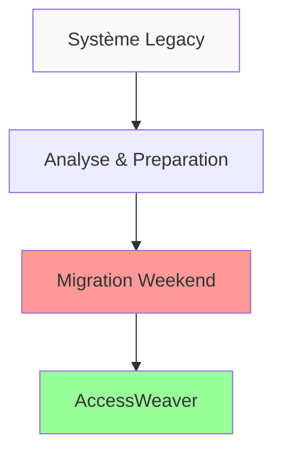
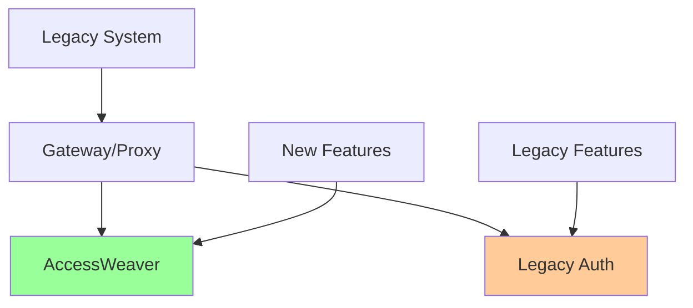
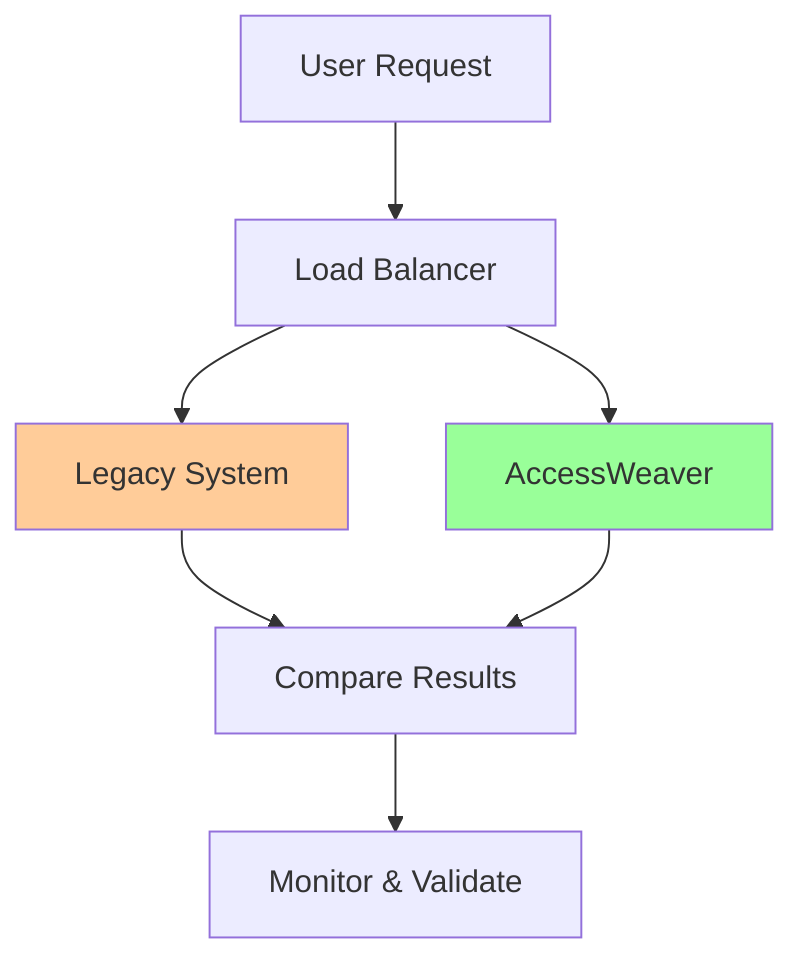

# 🔄 Migration & Upgrades - AccessWeaver

Guide pour migrer vers AccessWeaver et gérer les mises à jour avec zero downtime.

## 🚀 Migration vers AccessWeaver

### Vue d'Ensemble

AccessWeaver propose plusieurs strategies de migration selon votre système actuel et vos contraintes business.

### 📊 Matrix de Migration

| Système Source | Complexité | Durée Estimée | Downtime |
|----------------|------------|---------------|----------|
| **Custom Authorization** | 🟡 Moyenne | 2-4 semaines | 0-2h |
| **OAuth2/OIDC** | 🟢 Faible | 1-2 semaines | 0h |
| **LDAP/AD** | 🟡 Moyenne | 2-3 semaines | 0-1h |
| **Legacy ACL** | 🔴 Élevée | 4-8 semaines | 2-4h |
| **Autre IAM** | 🟡 Moyenne | 3-6 semaines | 0-2h |

### 🔄 Strategies de Migration

#### 1. Big Bang Migration


**Avantages :**
- Migration rapide et complète
- Pas de coexistence complexe
- Effort concentré

**Inconvénients :**
- Risque élevé
- Downtime important
- Rollback difficile

#### 2. Strangler Fig Pattern (Recommandé)


**Avantages :**
- Migration progressive
- Risque maîtrisé
- Zero downtime possible

**Inconvénients :**
- Plus complexe
- Période de coexistence
- Effort prolongé

#### 3. Parallel Run Migration


### 📋 Migration Checklist

#### Phase 1: Analyse & Préparation (1-2 semaines)

**🔍 Analyse du Système Existant**
- [ ] Cartographier les utilisateurs et rôles actuels
- [ ] Identifier les permissions et ressources
- [ ] Analyser les flows d'authentification/autorisation
- [ ] Documenter les intégrations existantes
- [ ] Évaluer les contraintes techniques

**📊 Audit des Données**
- [ ] Inventaire complet des utilisateurs
- [ ] Mapping des rôles et permissions
- [ ] Identification des ressources protégées
- [ ] Analyse de la qualité des données
- [ ] Détection des doublons et incohérences

**🎯 Définition du Scope**
- [ ] Périmètre de la migration
- [ ] Planning et jalons
- [ ] Critères de succès
- [ ] Plan de communication
- [ ] Formation des équipes

#### Phase 2: Setup AccessWeaver (1 semaine)

**🏗 Infrastructure**
- [ ] Déploiement environnement de dev
- [ ] Configuration multi-tenant
- [ ] Setup des environnements staging/prod
- [ ] Configuration monitoring et logging
- [ ] Tests de connectivité

**⚙️ Configuration Initiale**
- [ ] Création du tenant principal
- [ ] Configuration des domaines d'authentification
- [ ] Setup des providers d'identité
- [ ] Configuration des policies de base
- [ ] Tests d'authentification

#### Phase 3: Migration des Données (1-2 semaines)

**📥 Import des Utilisateurs**
- [ ] Script d'extraction depuis le système source
- [ ] Transformation et nettoyage des données
- [ ] Import via API AccessWeaver
- [ ] Validation et réconciliation
- [ ] Tests d'authentification utilisateurs

**🔐 Migration des Permissions**
- [ ] Mapping des rôles legacy vers AccessWeaver
- [ ] Création des ressources et actions
- [ ] Import des assignments utilisateur-rôle
- [ ] Validation des permissions
- [ ] Tests d'autorisation

#### Phase 4: Tests & Validation (1 semaine)

**🧪 Tests Fonctionnels**
- [ ] Tests d'authentification end-to-end
- [ ] Validation des autorisations par rôle
- [ ] Tests des flows business critiques
- [ ] Validation multi-tenant
- [ ] Tests de performance

**🔒 Tests de Sécurité**
- [ ] Tests de pénétration
- [ ] Validation de l'isolation tenant
- [ ] Tests de tentatives d'élévation de privilèges
- [ ] Audit des logs de sécurité
- [ ] Validation conformité RGPD

#### Phase 5: Go-Live (1-2 jours)

**🚀 Déploiement Production**
- [ ] Backup complet du système legacy
- [ ] Déploiement AccessWeaver en production
- [ ] Migration finale des données delta
- [ ] Basculement du trafic
- [ ] Monitoring intensif

**📊 Monitoring Post-Migration**
- [ ] Surveillance des métriques de performance
- [ ] Monitoring des erreurs et exceptions
- [ ] Validation des flows utilisateurs
- [ ] Support utilisateur renforcé
- [ ] Collecte de feedback

### 🛠 Outils de Migration

#### Migration CLI Tool

```bash
# Installation
npm install -g @accessweaver/migration-cli

# Configuration
accessweaver-migrate init --source-type ldap --target-tenant tenant-123

# Analyse du système source
accessweaver-migrate analyze --config migration.json

# Preview de la migration
accessweaver-migrate preview --dry-run

# Exécution de la migration
accessweaver-migrate execute --confirm

# Validation post-migration
accessweaver-migrate validate --report
```

#### Configuration de Migration

```yaml
# migration.yml
source:
  type: "ldap"
  connection:
    host: "ldap.company.com"
    port: 389
    bindDN: "cn=admin,dc=company,dc=com"
    bindPassword: "${LDAP_PASSWORD}"
  
  mapping:
    users:
      base: "ou=users,dc=company,dc=com"
      filter: "(objectClass=person)"
      attributes:
        email: "mail"
        firstName: "givenName"
        lastName: "sn"
        groups: "memberOf"
    
    groups:
      base: "ou=groups,dc=company,dc=com"
      filter: "(objectClass=group)"
      attributes:
        name: "cn"
        description: "description"
        members: "member"

target:
  tenant: "company-prod"
  endpoint: "https://api.accessweaver.com"
  apiKey: "${ACCESSWEAVER_API_KEY}"
  
  roleMapping:
    "cn=admin,ou=groups,dc=company,dc=com": "admin"
    "cn=users,ou=groups,dc=company,dc=com": "user"
    "cn=managers,ou=groups,dc=company,dc=com": "manager"

migration:
  batchSize: 100
  parallelism: 4
  validateBeforeImport: true
  rollbackOnError: true
  preserveIds: false
```

## 📋 Checklists Complètes

### 🔄 Pre-Migration Checklist

#### Planning & Preparation
- [ ] **Business case** validated and approved
- [ ] **Migration strategy** selected and documented
- [ ] **Timeline** established with all stakeholders
- [ ] **Resource allocation** confirmed (team, infrastructure)
- [ ] **Risk assessment** completed with mitigation plans

#### Technical Readiness
- [ ] **Current system audit** completed
- [ ] **Data mapping** documented
- [ ] **Integration points** identified
- [ ] **Test environments** provisioned and configured
- [ ] **Backup and rollback plans** tested

#### Team Preparation
- [ ] **Training** completed for all team members
- [ ] **Roles and responsibilities** clearly defined
- [ ] **Communication plan** established
- [ ] **Escalation procedures** documented
- [ ] **Support procedures** during migration defined
- [ ] **Team availability** confirmed for migration window
- [ ] **External vendor coordination** if applicable

#### Infrastructure & Security
- [ ] **Infrastructure capacity** validated for peak loads
- [ ] **Security reviews** completed for new systems
- [ ] **Network connectivity** tested between systems
- [ ] **Monitoring systems** configured and tested
- [ ] **Access controls** reviewed and updated
- [ ] **RGPD compliance** validation completed
- [ ] **Data retention policies** defined and implemented

### ⚡ During Migration Checklist

#### Pre-Migration Final Steps
- [ ] **Final backup** of source system completed
- [ ] **Migration maintenance window** activated
- [ ] **Stakeholders notified** of migration start
- [ ] **Monitoring dashboards** actively monitored
- [ ] **Communication channels** established with team

#### Migration Execution
- [ ] **Data freeze** on source system implemented
- [ ] **ETL processes** executing successfully
- [ ] **Data validation** checkpoints passed
- [ ] **Incremental data sync** completed
- [ ] **System integration tests** passing
- [ ] **Performance benchmarks** within acceptable limits

#### Quality Gates
- [ ] **Data integrity** validation passed
- [ ] **Business logic** validation completed
- [ ] **User acceptance testing** signed off
- [ ] **Load testing** results acceptable
- [ ] **Security scanning** completed successfully
- [ ] **Rollback readiness** confirmed

#### Go-Live Preparation
- [ ] **DNS changes** ready for execution
- [ ] **Load balancer** configuration updated
- [ ] **Feature flags** configured for gradual rollout
- [ ] **User communication** prepared for deployment
- [ ] **Support team** standing by

### ✅ Post-Migration Checklist

#### Immediate Post-Migration (First 2 Hours)
- [ ] **System health** monitoring shows green status
- [ ] **Critical business functions** verified working
- [ ] **User authentication** tested and functional
- [ ] **API endpoints** responding correctly
- [ ] **Database connections** stable
- [ ] **Cache systems** populated and working
- [ ] **Error rates** within normal parameters

#### First 24 Hours
- [ ] **Performance metrics** reviewed and acceptable
- [ ] **User feedback** collected and addressed
- [ ] **Support tickets** triaged and resolved
- [ ] **Data consistency** checks completed
- [ ] **Business metrics** tracking normally
- [ ] **Integration partners** notified of completion
- [ ] **Monitoring alerts** configured for new system

#### First Week
- [ ] **Comprehensive testing** of all features completed
- [ ] **User training** sessions conducted
- [ ] **Documentation** updated with new procedures
- [ ] **Legacy system** decommissioning initiated
- [ ] **Performance optimization** identified and planned
- [ ] **Cost analysis** completed and reported

#### First Month
- [ ] **Performance trends** analyzed and optimized
- [ ] **User adoption** metrics reviewed
- [ ] **Security audit** completed on new system
- [ ] **Backup and recovery** procedures tested
- [ ] **Disaster recovery** plan updated
- [ ] **Lessons learned** document created
- [ ] **Next phase** planning initiated if applicable

### 🔄 Version Upgrade Checklist

#### Pre-Upgrade Planning
- [ ] **Release notes** reviewed thoroughly
- [ ] **Breaking changes** identified and planned for
- [ ] **Dependencies** validated for compatibility
- [ ] **Test environment** upgraded and validated
- [ ] **Rollback plan** prepared and tested
- [ ] **Downtime window** scheduled with stakeholders

#### Database Upgrade Preparation
- [ ] **Database backup** completed and verified
- [ ] **Schema migration** scripts tested
- [ ] **Data migration** scripts validated
- [ ] **Index optimization** planned post-upgrade
- [ ] **Performance baseline** established
- [ ] **Recovery time** estimated and documented

#### Application Upgrade
- [ ] **Blue-green deployment** environment prepared
- [ ] **Configuration changes** reviewed and staged
- [ ] **Feature flags** configured for new features
- [ ] **Security patches** included in upgrade
- [ ] **Performance improvements** documented
- [ ] **Monitoring enhancements** deployed

#### Post-Upgrade Validation
- [ ] **Smoke tests** completed successfully
- [ ] **Integration tests** passing
- [ ] **Performance benchmarks** met or exceeded
- [ ] **Security scans** completed with no issues
- [ ] **User acceptance** testing completed
- [ ] **Monitoring** showing normal operations

### 🏗 Infrastructure Update Checklist

#### Infrastructure Planning
- [ ] **Change impact** assessment completed
- [ ] **Resource requirements** calculated
- [ ] **Cost implications** reviewed and approved
- [ ] **Security implications** assessed
- [ ] **Compliance requirements** validated
- [ ] **Vendor coordination** completed if applicable

#### Update Execution
- [ ] **Infrastructure backup** or snapshot created
- [ ] **Rolling update** strategy implemented
- [ ] **Health checks** passing throughout update
- [ ] **Auto-scaling** policies adjusted if needed
- [ ] **Network changes** validated
- [ ] **Storage modifications** completed successfully

#### Validation & Testing
- [ ] **Infrastructure health** monitoring green
- [ ] **Application connectivity** verified
- [ ] **Performance testing** completed
- [ ] **Disaster recovery** capability tested
- [ ] **Backup systems** validated
- [ ] **Monitoring systems** updated and functional

### 🚨 Emergency Rollback Checklist

#### Immediate Assessment (0-5 minutes)
- [ ] **Issue severity** determined (P0-P4)
- [ ] **Impact scope** identified (users, systems, data)
- [ ] **Rollback decision** made by authorized personnel
- [ ] **Incident commander** assigned
- [ ] **Communication channels** activated
- [ ] **Rollback authorization** obtained

#### Rollback Execution (5-15 minutes)
- [ ] **Database rollback** initiated if required
- [ ] **Application rollback** to previous version
- [ ] **Infrastructure rollback** if applicable
- [ ] **DNS changes** reverted if modified
- [ ] **Cache invalidation** completed
- [ ] **Feature flags** reverted to safe state

#### Validation & Communication (15-30 minutes)
- [ ] **System health** verified post-rollback
- [ ] **Critical functions** tested and working
- [ ] **User impact** assessed and minimized
- [ ] **Stakeholder communication** sent
- [ ] **Incident documentation** initiated
- [ ] **Root cause analysis** planning started

#### Post-Rollback Actions (30+ minutes)
- [ ] **Service restoration** confirmed
- [ ] **User notification** if customer-facing
- [ ] **Monitoring enhancement** to prevent recurrence
- [ ] **Post-mortem** scheduled within 24h
- [ ] **Fix planning** for next deployment
- [ ] **Process improvements** identified

---

## 🎯 Best Practices & Métriques

### 🏆 Migration Best Practices

#### 1. **Progressive Migration Strategy**
```java
// Exemple d'implémentation progressive
@Component
public class ProgressiveMigrationController {
    
    // Commencer par 1% des utilisateurs
    public boolean shouldUseMigration(String tenantId) {
        return featureFlagService.isEnabled("migration.accessweaver", tenantId);
    }
    
    // Gradual rollout: 1% -> 5% -> 25% -> 50% -> 100%
    public void incrementMigrationPercentage(double targetPercentage) {
        featureFlagService.updatePercentage("migration.accessweaver", targetPercentage);
    }
}
```

#### 2. **Data Validation Patterns**
- **Checksum validation** pour l'intégrité des données
- **Count reconciliation** pour vérifier les volumes
- **Business rule validation** pour la cohérence métier
- **Cross-reference validation** pour les relations

#### 3. **Monitoring & Alerting**
```yaml
# Métriques clés à surveiller
metrics:
  migration:
    - divergence_rate: <5%
    - error_rate: <0.1%
    - latency_impact: <20%
    - data_consistency: 100%
  
  alerts:
    - critical: divergence_rate > 10%
    - warning: error_rate > 1%
    - info: latency_impact > 50%
```

### 📊 Métriques de Succès

#### Migration Success Metrics

| Métrique | Objectif | Excellent | Bon | Acceptable |
|----------|----------|-----------|-----|------------|
| **Data Loss** | 0% | 0% | 0% | 0% |
| **Downtime** | <1h | <30min | <1h | <2h |
| **Divergence Rate** | <1% | <0.1% | <1% | <5% |
| **Performance Impact** | <10% | <5% | <10% | <20% |
| **User Satisfaction** | >90% | >95% | >90% | >80% |
| **Time to Migrate** | As planned | -20% | ±10% | +20% |

#### Version Upgrade Metrics

| Métrique | Dev | Staging | Production |
|----------|-----|---------|------------|
| **Upgrade Time** | <30min | <1h | <2h |
| **Rollback Time** | <5min | <10min | <15min |
| **Success Rate** | >95% | >98% | >99.9% |
| **Test Coverage** | >80% | >90% | >95% |

#### Infrastructure Update Metrics

| Composant | Availability Target | MTTR | MTBF |
|-----------|-------------------|------|------|
| **API Gateway** | 99.95% | <5min | >30d |
| **Database** | 99.99% | <10min | >60d |
| **Cache** | 99.9% | <2min | >14d |
| **Load Balancer** | 99.99% | <1min | >90d |

### 🛠 Outils et Technologies Recommandés

#### Migration Tools
- **Flyway** - Database migrations
- **Liquibase** - Alternative database versioning
- **Apache Kafka** - Data streaming during migration
- **Apache NiFi** - Data flow automation
- **Terraform** - Infrastructure as Code
- **Ansible** - Configuration management

#### Monitoring & Observability
- **Prometheus + Grafana** - Metrics and dashboards
- **ELK Stack** - Logging and analysis
- **Jaeger** - Distributed tracing
- **New Relic / DataDog** - APM solutions
- **PagerDuty** - Incident management

#### Testing Tools
- **JMeter** - Load testing
- **Postman** - API testing
- **Selenium** - UI testing
- **TestContainers** - Integration testing
- **Chaos Monkey** - Resilience testing

### 📚 Documentation Standards

#### 1. **Migration Runbook Template**
```markdown
# Migration Runbook - [System Name]

## Overview
- **Objective**: 
- **Scope**: 
- **Timeline**: 
- **Stakeholders**: 

## Pre-Migration
- [ ] Checklist item 1
- [ ] Checklist item 2

## Migration Steps
1. **Step 1**: Description
   - Command: `command here`
   - Expected result: 
   - Rollback: 

## Post-Migration
- [ ] Validation step 1
- [ ] Validation step 2

## Troubleshooting
- **Issue**: Symptom
- **Solution**: Fix

## Contacts
- **Primary**: Name (phone/email)
- **Secondary**: Name (phone/email)
```

#### 2. **Change Log Standards**
```markdown
# Change Log - AccessWeaver v2.1.0

## [2.1.0] - 2024-03-15

### Added
- New ABAC engine with OPA integration
- Enhanced multi-tenant isolation
- Real-time policy updates

### Changed
- Database schema optimization
- API response format improvements
- Performance enhancements

### Deprecated
- Legacy RBAC endpoints (will be removed in v3.0)

### Removed
- Unused configuration parameters

### Fixed
- Race condition in cache invalidation
- Memory leak in policy evaluation

### Security
- Updated dependencies with security patches
- Enhanced encryption for data at rest
```

### 🔄 Continuous Improvement

#### 1. **Post-Migration Reviews**
- **Lessons Learned** - Documentation des apprentissages
- **Process Improvements** - Optimisation des procédures
- **Tool Evaluation** - Évaluation de nouveaux outils
- **Team Training** - Formation continue des équipes

#### 2. **Automation Enhancement**
```java
// Exemple d'automatisation progressive
@Service
public class MigrationAutomationService {
    
    // Automatiser les tâches répétitives
    @Scheduled(cron = "0 0 2 * * SUN") // Dimanche 2h du matin
    public void weeklyMigrationHealthCheck() {
        List<String> tenants = getAllMigratedTenants();
        
        for (String tenant : tenants) {
            MigrationHealth health = assessMigrationHealth(tenant);
            
            if (health.needsAttention()) {
                scheduleMaintenanceTask(tenant, health.getIssues());
            }
        }
    }
}
```

### 📞 Support & Escalation

#### Équipe de Support Migration

| Rôle | Responsabilité | Contact | Disponibilité |
|------|---------------|---------|---------------|
| **Migration Lead** | Décisions techniques | lead@accessweaver.com | 24/7 |
| **Database Admin** | DB migrations | dba@accessweaver.com | Business hours |
| **DevOps Engineer** | Infrastructure | devops@accessweaver.com | 24/7 |
| **Security Officer** | Validation sécurité | security@accessweaver.com | Business hours |

#### Escalation Matrix

| Severity | Response Time | Escalation Path |
|----------|---------------|-----------------|
| **P0 - Critical** | 15 minutes | Migration Lead → CTO |
| **P1 - High** | 1 hour | Team Lead → Migration Lead |
| **P2 - Medium** | 4 hours | Engineer → Team Lead |
| **P3 - Low** | 1 business day | Self-service → Engineer |

---

## 🎉 Conclusion

Ce guide complet de migration et upgrades pour AccessWeaver fournit tous les éléments nécessaires pour:

✅ **Planifier** une migration réussie vers AccessWeaver  
✅ **Exécuter** des upgrades zero-downtime  
✅ **Gérer** les rollbacks d'urgence  
✅ **Maintenir** la qualité de service  
✅ **Améliorer** continuellement les processus

### 📋 Actions Immédiates

1. **Évaluer** votre situation actuelle avec la matrice de migration
2. **Sélectionner** la stratégie adaptée à vos contraintes
3. **Préparer** votre équipe avec les checklists fournies
4. **Tester** les procédures en environnement de staging
5. **Planifier** votre migration avec les timeline recommandées

### 🔮 Évolution Future

Ce document évoluera avec:
- **Nouveaux patterns** de migration découverts
- **Retours d'expérience** des migrations clients
- **Améliorations** des outils et processus
- **Nouvelles technologies** et meilleures pratiques

**📧 Feedback**: Vos retours sont essentiels pour améliorer ce guide. Contactez l'équipe AccessWeaver pour partager vos expériences de migration.

---

**🔄 Version du document**: 1.0  
**📅 Dernière mise à jour**: Mars 2024  
**👥 Contributeurs**: Équipe Platform AccessWeaver  
**📖 Statut**: Production Ready