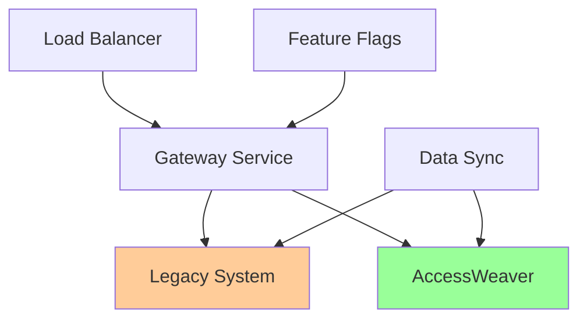

## ⚡ Zero Downtime Migration

### Architecture Zero-Downtime



### 🚀 Stratégie de Basculement Progressive

#### 1. Dual-Write Pattern

```java
@Service
@Slf4j
public class DualWriteAuthorizationService implements AuthorizationService {
    
    private final LegacyAuthorizationService legacyService;
    private final AccessWeaverService accessWeaverService;
    private final FeatureFlagService featureFlags;
    private final ComparisonService comparisonService;
    
    @Override
    public AuthorizationResult authorize(AuthorizationRequest request) {
        String tenantId = request.getTenantId();
        
        // Vérifier la stratégie pour ce tenant
        MigrationStrategy strategy = featureFlags.getMigrationStrategy(tenantId);
        
        switch (strategy) {
            case LEGACY_ONLY:
                return legacyService.authorize(request);
                
            case DUAL_WRITE_LEGACY_READ:
                return dualWriteLegacyRead(request);
                
            case DUAL_WRITE_ACCESSWEAVER_READ:
                return dualWriteAccessWeaverRead(request);
                
            case ACCESSWEAVER_ONLY:
                return accessWeaverService.authorize(request);
                
            default:
                throw new IllegalStateException("Unknown migration strategy: " + strategy);
        }
    }
    
    private AuthorizationResult dualWriteLegacyRead(AuthorizationRequest request) {
        // Lecture depuis legacy (source de vérité)
        AuthorizationResult legacyResult = legacyService.authorize(request);
        
        // Écriture asynchrone vers AccessWeaver (pour sync)
        CompletableFuture.runAsync(() -> {
            try {
                AuthorizationResult awResult = accessWeaverService.authorize(request);
                comparisonService.compareResults(request, legacyResult, awResult);
            } catch (Exception e) {
                log.warn("AccessWeaver authorization failed during dual-write: {}", 
                        e.getMessage());
            }
        });
        
        return legacyResult;
    }
    
    private AuthorizationResult dualWriteAccessWeaverRead(AuthorizationRequest request) {
        // Lecture depuis AccessWeaver (nouvelle source de vérité)
        AuthorizationResult awResult = accessWeaverService.authorize(request);
        
        // Écriture asynchrone vers legacy (pour comparaison)
        CompletableFuture.runAsync(() -> {
            try {
                AuthorizationResult legacyResult = legacyService.authorize(request);
                comparisonService.compareResults(request, legacyResult, awResult);
            } catch (Exception e) {
                log.warn("Legacy authorization failed during dual-write: {}", 
                        e.getMessage());
            }
        });
        
        return awResult;
    }
}
```

#### 2. Comparison Service

```java
@Service
@Slf4j
public class ComparisonService {
    
    private final MeterRegistry meterRegistry;
    private final AlertingService alertingService;
    
    public void compareResults(AuthorizationRequest request,
                             AuthorizationResult legacyResult,
                             AuthorizationResult accessWeaverResult) {
        
        ComparisonResult comparison = ComparisonResult.builder()
            .request(request)
            .legacyResult(legacyResult)
            .accessWeaverResult(accessWeaverResult)
            .timestamp(Instant.now())
            .build();
        
        // Comparaison de base
        boolean decisionsMatch = legacyResult.isAllowed() == accessWeaverResult.isAllowed();
        comparison.setDecisionsMatch(decisionsMatch);
        
        // Comparaison des détails
        comparePermissions(comparison);
        compareRoles(comparison);
        compareMetadata(comparison);
        
        // Métriques
        recordMetrics(comparison);
        
        // Alerting si divergence
        if (!decisionsMatch) {
            handleDivergence(comparison);
        }
        
        // Logging pour analyse
        logComparison(comparison);
    }
    
    private void recordMetrics(ComparisonResult comparison) {
        String tenantId = comparison.getRequest().getTenantId();
        
        meterRegistry.counter("authorization.comparison.total",
            "tenant", tenantId,
            "match", String.valueOf(comparison.isDecisionsMatch()))
            .increment();
        
        if (!comparison.isDecisionsMatch()) {
            meterRegistry.counter("authorization.comparison.divergence",
                "tenant", tenantId,
                "type", comparison.getDivergenceType().toString())
                .increment();
        }
    }
    
    private void handleDivergence(ComparisonResult comparison) {
        log.warn("Authorization divergence detected: {}", comparison);
        
        // Alerting selon la criticité
        if (comparison.getRequest().isCriticalResource()) {
            alertingService.sendCriticalAlert(
                "Critical authorization divergence detected",
                comparison
            );
        }
        
        // Escalation si trop de divergences
        checkDivergenceThreshold(comparison.getRequest().getTenantId());
    }
}
```

#### 3. Feature Flag Migration

```java
@Service
public class MigrationFeatureFlagService {
    
    private final RedisTemplate<String, Object> redisTemplate;
    
    public MigrationStrategy getMigrationStrategy(String tenantId) {
        String key = "migration:strategy:" + tenantId;
        String strategy = (String) redisTemplate.opsForValue().get(key);
        
        if (strategy == null) {
            return MigrationStrategy.LEGACY_ONLY; // Default safe
        }
        
        return MigrationStrategy.valueOf(strategy);
    }
    
    public void setMigrationStrategy(String tenantId, MigrationStrategy strategy) {
        String key = "migration:strategy:" + tenantId;
        redisTemplate.opsForValue().set(key, strategy.toString());
        
        // Log pour audit
        log.info("Migration strategy changed for tenant {}: {}", tenantId, strategy);
        
        // Notification aux autres instances
        redisTemplate.convertAndSend("migration:strategy:changes", 
            Map.of("tenantId", tenantId, "strategy", strategy.toString()));
    }
    
    public void rolloutStrategy(MigrationStrategy strategy, double percentage) {
        // Déploiement graduel par pourcentage de tenants
        List<String> allTenants = getAllActiveTenants();
        int targetCount = (int) (allTenants.size() * percentage / 100.0);
        
        List<String> selectedTenants = allTenants.stream()
            .limit(targetCount)
            .collect(Collectors.toList());
        
        for (String tenantId : selectedTenants) {
            setMigrationStrategy(tenantId, strategy);
        }
        
        log.info("Rolled out strategy {} to {} tenants ({}%)", 
                strategy, selectedTenants.size(), percentage);
    }
}
```

### 📊 Migration Monitoring

```java
@Component
public class MigrationMonitoringService {
    
    @Scheduled(fixedDelay = 30000) // Toutes les 30 secondes
    public void monitorMigrationHealth() {
        List<String> activeTenants = getAllActiveTenants();
        
        for (String tenantId : activeTenants) {
            MigrationHealth health = assessTenantMigrationHealth(tenantId);
            
            if (health.hasIssues()) {
                handleMigrationIssues(tenantId, health);
            }
            
            recordMigrationMetrics(tenantId, health);
        }
    }
    
    private MigrationHealth assessTenantMigrationHealth(String tenantId) {
        return MigrationHealth.builder()
            .tenantId(tenantId)
            .divergenceRate(calculateDivergenceRate(tenantId))
            .errorRate(calculateErrorRate(tenantId))
            .latencyDelta(calculateLatencyDelta(tenantId))
            .dataConsistency(checkDataConsistency(tenantId))
            .build();
    }
    
    private void handleMigrationIssues(String tenantId, MigrationHealth health) {
        if (health.getDivergenceRate() > 0.05) { // Plus de 5% de divergence
            log.warn("High divergence rate for tenant {}: {}%", 
                    tenantId, health.getDivergenceRate() * 100);
            
            // Auto-rollback si divergence critique
            if (health.getDivergenceRate() > 0.2) {
                rollbackTenant(tenantId, "High divergence rate");
            }
        }
        
        if (health.getErrorRate() > 0.1) { // Plus de 10% d'erreurs
            log.error("High error rate for tenant {}: {}%", 
                     tenantId, health.getErrorRate() * 100);
            
            rollbackTenant(tenantId, "High error rate");
        }
    }
    
    private void rollbackTenant(String tenantId, String reason) {
        log.warn("Auto-rollback triggered for tenant {}: {}", tenantId, reason);
        
        featureFlagService.setMigrationStrategy(tenantId, MigrationStrategy.LEGACY_ONLY);
        
        alertingService.sendAlert(
            String.format("Auto-rollback executed for tenant %s: %s", tenantId, reason)
        );
    }
}
```
