# 🧪 Stratégie de Test AccessWeaver

## Introduction

Ce document présente une vue d'ensemble de la stratégie de test complète d'AccessWeaver. Il sert de référence centralisée pour comprendre l'approche globale, les méthodologies et les pratiques recommandées pour tous les types de tests appliqués à notre infrastructure.

---

## Vue d'Ensemble de la Stratégie de Test

AccessWeaver utilise une approche de test complète, multicouche et automatisée pour garantir la fiabilité, la sécurité et la performance de son infrastructure. Notre stratégie s'appuie sur les principes DevOps et intègre les tests à chaque étape du cycle de développement et déploiement.

### Objectifs Principaux

- **Fiabilité** - Assurer un fonctionnement stable et prévisible
- **Sécurité** - Protéger contre les vulnérabilités et menaces
- **Performance** - Garantir des performances optimales sous charge
- **Conformité** - Respecter les standards et réglementations
- **Évolutivité** - Valider la capacité à évoluer selon les besoins

### Approche Pyramidale

Notre stratégie de test suit une approche pyramidale :

```mermaid
graph TD
    A[Tests Unitaires] -->|Base| B[Tests d'Intégration]
    B -->|Milieu| C[Tests Fonctionnels]
    C -->|Sommet| D[Tests de Performance & Chaos]
```

| Niveau | Fréquence | Coût | Complexité | Valeur |
|--------|-----------|------|------------|--------|
| **Unitaire** | Très fréquent | Faible | Simple | Validation rapide |
| **Intégration** | Fréquent | Moyen | Moyenne | Validation des interactions |
| **Fonctionnel** | Modéré | Élevé | Élevée | Validation des fonctionnalités |
| **Performance/Chaos** | Périodique | Très élevé | Très élevée | Validation de la résilience |

---

## Types de Tests

AccessWeaver implémente les types de tests suivants, chacun avec son propre objectif et méthodologie.

### 1. Tests d'Infrastructure

Les tests d'infrastructure valident que les ressources AWS provisionnées via Terraform fonctionnent correctement et répondent aux spécifications.

**Principales caractéristiques:**
- Validation de la conformité IaC
- Détection des dérives d'infrastructure
- Vérification des bonnes pratiques AWS

[**Documentation détaillée →**](../testing/infrastructure.md)

### 2. Tests Automatisés

Les tests automatisés éliminent les processus manuels répétitifs et assurent la cohérence des validations à travers les environnements.

**Principales caractéristiques:**
- Exécution dans les pipelines CI/CD
- Rapports et métriques automatisés
- Couverture de test mesurable

[**Documentation détaillée →**](../testing/automated.md)

### 3. Tests de Sécurité

Les tests de sécurité identifient les vulnérabilités et vérifient la conformité aux standards de sécurité.

**Principales caractéristiques:**
- Analyse statique et dynamique
- Scans de vulnérabilités
- Tests de pénétration

[**Documentation détaillée →**](../testing/security.md)

### 4. Tests d'Intégration

Les tests d'intégration valident les interactions entre différents composants d'infrastructure et services.

**Principales caractéristiques:**
- Validation des interactions entre services
- Tests de connectivité
- Vérification des flux de données

[**Documentation détaillée →**](../testing/integration.md)

### 5. Tests de Chaos

Les tests de chaos évaluent la résilience et la robustesse de l'infrastructure face à des perturbations.

**Principales caractéristiques:**
- Simulation de pannes contrôlées
- Validation des mécanismes de récupération
- Identification des points faibles

[**Documentation détaillée →**](../testing/chaos.md)

---

## Intégration au Cycle de Développement

La stratégie de test d'AccessWeaver s'intègre pleinement au cycle de développement à travers un pipeline CI/CD complet.

### Flux de Travail

```mermaid
graph LR
    A[Code] --> B[Commit]
    B --> C[Tests Unitaires]
    C --> D[PR/Review]
    D --> E[Tests d'Intégration]
    E --> F[Merge]
    F --> G[Tests de Validation]
    G --> H[Déploiement]
    H --> I[Tests Post-Déploiement]
```

### Phases de Test dans le CI/CD

| Phase | Moment | Tests Exécutés | Objectif |
|-------|--------|----------------|----------|
| **Pre-commit** | Avant le commit | Lint, format, validation | Qualité du code |
| **CI Pipeline** | À chaque commit | Unitaires, sécurité basique | Feedback rapide |
| **PR Validation** | Avant merge | Intégration, sécurité approfondie | Validation complète |
| **Post-Deploy** | Après déploiement | Fonctionnels, performance | Vérification en production |
| **Périodique** | Planifié | Chaos, pénétration | Validation de résilience |

---

## Environnements de Test

AccessWeaver utilise plusieurs environnements pour les différentes phases de test.

### Structure des Environnements

| Environnement | Usage | Caractéristiques |
|--------------|-------|------------------|
| **Local** | Développement, tests unitaires | Émulateurs, mocks |
| **Dev** | Tests d'intégration basiques | Infrastructure minimale |
| **Staging** | Tests complets pré-production | Similaire à la production |
| **Production** | Tests non-intrusifs, monitoring | Environnement réel |

### Isolation et Gouvernance

- Chaque environnement est isolé avec ses propres ressources
- Accès contrôlé selon le principe du moindre privilège
- Données de test anonymisées ou synthétiques
- Nettoyage automatique des ressources temporaires

---

## Outillage

AccessWeaver utilise un ensemble d'outils spécialisés pour chaque type de test.

### Outils par Catégorie

| Catégorie | Outils Principaux | Usage |
|-----------|-------------------|-------|
| **IaC** | Terraform Validate, TFLint, Checkov | Validation Terraform |
| **Sécurité** | tfsec, Prowler, AWS Security Hub | Scans de sécurité |
| **Intégration** | Terratest, Localstack | Tests d'infrastructure |
| **Performance** | JMeter, k6, AWS Load Testing | Tests de charge |
| **Chaos** | AWS FIS, Chaos Toolkit | Tests de résilience |
| **Monitoring** | CloudWatch, Prometheus, Grafana | Surveillance |

### Matrice d'Outillage Complet

[Voir la matrice complète dans la documentation détaillée](../testing/automated.md#outils-dautomatisation)

---

## Métriques et Rapports

AccessWeaver mesure l'efficacité de sa stratégie de test à travers plusieurs métriques clés.

### Indicateurs de Performance (KPIs)

| Métrique | Cible | Suivi | Objectif |
|----------|-------|-------|----------|
| **Couverture de Code** | >80% | SonarQube | Qualité du code |
| **Taux de Réussite** | >99% | Jenkins | Stabilité des tests |
| **Temps d'Exécution** | <30min | Jenkins | Rapidité du feedback |
| **Défauts Détectés** | Tendance ↓ | Jira | Amélioration continue |
| **MTTR** | <2h | Monitoring | Résilience |

### Rapports Standardisés

- **Rapport de Test Quotidien** - Résumé des tests exécutés
- **Rapport de Sécurité Hebdomadaire** - Vulnérabilités et recommandations
- **Tableau de Bord de Qualité** - Tendances et métriques
- **Rapport de Conformité** - Validation des standards

---

## Meilleures Pratiques

### Conception des Tests

- **Tests Atomiques** - Chaque test doit valider une seule chose
- **Tests Indépendants** - Pas de dépendances entre tests
- **Tests Idempotents** - Résultats identiques à chaque exécution
- **Tests Rapides** - Optimisés pour minimiser le temps d'exécution
- **Tests Clairs** - Documentation précise du but et des attentes

### Gouvernance

- **Tests comme Documentation** - Les tests servent de documentation exécutable
- **Revue de Tests** - Les tests sont revus comme le code
- **Maintenance Continue** - Les tests sont mis à jour avec le code
- **Analyse des Échecs** - Chaque échec est investigué et documenté
- **Amélioration Itérative** - La stratégie de test évolue constamment

---

## Ressources

### Documentation Interne

- [Infrastructure Testing](../testing/infrastructure.md)
- [Automated Testing](../testing/automated.md)
- [Security Testing](../testing/security.md)
- [Integration Testing](../testing/integration.md)
- [Chaos Engineering](../testing/chaos.md)

### Références Externes

- [AWS Well-Architected Framework](https://aws.amazon.com/architecture/well-architected/)
- [Terraform Testing Best Practices](https://developer.hashicorp.com/terraform/tutorials/configuration-language/test)
- [OWASP Testing Guide](https://owasp.org/www-project-web-security-testing-guide/)
- [Google SRE Book: Testing](https://sre.google/sre-book/testing-reliability/)
- [Infrastructure as Code Testing Strategies](https://www.thoughtworks.com/insights/blog/infrastructure-code-testing-strategies)
