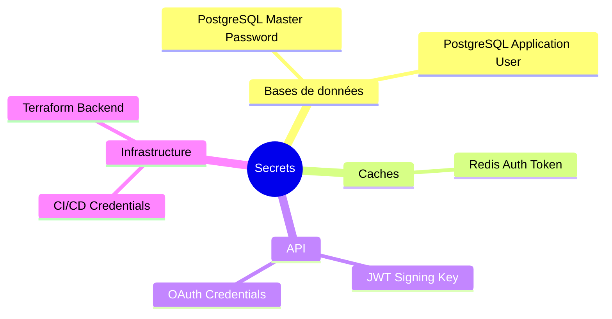

# 🔑 Gestion des Secrets pour AccessWeaver

Guide détaillé pour configurer et gérer les informations sensibles de l'infrastructure AccessWeaver.

---

## 📚 Table des Matières

- [Vue d'Ensemble](#vue-densemble)
- [AWS Secrets Manager](#aws-secrets-manager)
- [AWS Systems Manager Parameter Store](#aws-systems-manager-parameter-store)
- [Intégration avec Terraform](#intégration-avec-terraform)
- [Rotation des Secrets](#rotation-des-secrets)
- [Sécurisation des CI/CD Pipelines](#sécurisation-des-cicd-pipelines)

---

## 🌐 Vue d'Ensemble

AccessWeaver utilise plusieurs types de secrets qui doivent être gérés de manière sécurisée :



### **Catégories de Secrets**

1. **Secrets d'Infrastructure** - Accès AWS, informations d'authentification Terraform
2. **Secrets de Base de Données** - Mots de passe PostgreSQL, identifiants de connexion
3. **Secrets d'Application** - Clés JWT, tokens d'authentification Redis
4. **Secrets d'Intégration** - Crédentials OAuth, clés d'API tierces

---

## 🔒 AWS Secrets Manager

AWS Secrets Manager est utilisé pour gérer les secrets principaux d'AccessWeaver.

### **1. Structure des secrets**

La convention de nommage suivante est utilisée pour les secrets :

```
accessweaver/<environment>/<service>/<secret-name>
```

Exemples :
```
accessweaver/dev/database/postgres-admin
accessweaver/staging/redis/auth-token
accessweaver/prod/api/jwt-signing-key
```

### **2. Création des secrets principaux**

```bash
# Secret pour la base de données PostgreSQL
aws secretsmanager create-secret \
  --name accessweaver/dev/database/postgres-admin \
  --secret-string '{"username":"awadmin","password":"VOTRE_MOT_DE_PASSE"}'

# Secret pour l'authentification Redis
aws secretsmanager create-secret \
  --name accessweaver/dev/redis/auth-token \
  --secret-string '{"auth_token":"VOTRE_TOKEN"}'
```

### **3. Protection avec KMS**

```bash
# Créer une clé KMS pour chiffrer les secrets
aws kms create-key \
  --description "Clé pour secrets AccessWeaver Dev" \
  --tags TagKey=Project,TagValue=AccessWeaver TagKey=Environment,TagValue=Dev

# Associé la clé KMS au secret
aws secretsmanager update-secret \
  --secret-id accessweaver/dev/database/postgres-admin \
  --kms-key-id "arn:aws:kms:region:account-id:key/key-id"
```

---

## ⚙️ AWS Systems Manager Parameter Store

Utilisé pour les configurations et références moins sensibles.

### **1. Organisation hiérarchique**

```
/accessweaver/
├── dev/
│   ├── config/
│   │   ├── db_host
│   │   ├── db_port
│   │   └── redis_host
│   └── secrets/
│       ├── db_password_arn
│       └── redis_token_arn
└── prod/
    ├── ...
```

### **2. Création des paramètres**

```bash
# Paramètre standard (non-secret)
aws ssm put-parameter \
  --name "/accessweaver/dev/config/db_host" \
  --value "aw-postgres.internal" \
  --type "String"

# Paramètre sécurisé (informations sensibles)
aws ssm put-parameter \
  --name "/accessweaver/dev/config/api_key" \
  --value "votre-api-key" \
  --type "SecureString"
```

### **3. Récupération des paramètres**

```bash
# Récupérer un ensemble de paramètres
aws ssm get-parameters-by-path \
  --path "/accessweaver/dev/config" \
  --recursive \
  --with-decryption
```

---

## 💾 Intégration avec Terraform

### **1. Récupération des secrets dans Terraform**

```hcl
# Récupérer un secret depuis AWS Secrets Manager
data "aws_secretsmanager_secret" "db_credentials" {
  name = "accessweaver/${var.environment}/database/postgres-admin"
}

data "aws_secretsmanager_secret_version" "db_credentials" {
  secret_id = data.aws_secretsmanager_secret.db_credentials.id
}

locals {
  # Parser le JSON du secret
  db_creds = jsondecode(data.aws_secretsmanager_secret_version.db_credentials.secret_string)
  
  # Utiliser les valeurs
  db_username = local.db_creds.username
  db_password = local.db_creds.password
}
```

### **2. Génération de secrets avec Terraform**

```hcl
# Générer un mot de passe aléatoire
resource "random_password" "redis_auth_token" {
  length           = 32
  special          = true
  override_special = "!#$%&*()-_=+[]{}<>:?"
}

# Stocker le secret généré
resource "aws_secretsmanager_secret" "redis_auth" {
  name = "accessweaver/${var.environment}/redis/auth-token"
}

resource "aws_secretsmanager_secret_version" "redis_auth" {
  secret_id     = aws_secretsmanager_secret.redis_auth.id
  secret_string = jsonencode({
    auth_token = random_password.redis_auth_token.result
  })
}
```

### **3. Intégration avec les modules Terraform**

Exemple d'utilisation dans le module RDS :

```hcl
module "rds" {
  source = "../../modules/rds"
  
  environment    = var.environment
  project_name   = var.project_name
  vpc_id         = module.vpc.vpc_id
  subnet_ids     = module.vpc.private_subnet_ids
  
  # Passage sécurisé des secrets
  master_username = local.db_creds.username
  master_password = local.db_creds.password
}
```

---

## 🔄 Rotation des Secrets

### **1. Configuration de la rotation automatique**

AccessWeaver implémente une rotation automatique des secrets critiques :

```bash
# Configurer la rotation pour un secret
aws secretsmanager rotate-secret \
  --secret-id accessweaver/dev/database/postgres-admin \
  --rotation-lambda-arn "arn:aws:lambda:region:account-id:function:accessweaver-rotate-db-creds" \
  --rotation-rules '{"AutomaticallyAfterDays": 30}'
```

### **2. Fonction Lambda de rotation**

Une fonction Lambda gère la rotation en suivant ces étapes :

1. Création d'un nouveau secret
2. Test du nouveau secret
3. Finalisation (mise à jour du mot de passe dans la base de données)
4. Vérification du nouveau secret

### **3. Fréquence de rotation recommandée**

| Type de Secret | Environnement | Fréquence |
|----------------|--------------|------------|
| DB Admin       | Dev          | 90 jours   |
| DB Admin       | Prod         | 30 jours   |
| Redis Auth     | Dev          | 90 jours   |
| Redis Auth     | Prod         | 45 jours   |
| JWT Signing    | Dev          | 60 jours   |
| JWT Signing    | Prod         | 30 jours   |

---

## 🔍 Sécurisation des CI/CD Pipelines

### **1. Intégration dans GitHub Actions**

```yaml
# .github/workflows/deploy.yml
name: Deploy Infrastructure

jobs:
  deploy:
    runs-on: ubuntu-latest
    steps:
      - uses: actions/checkout@v3
      
      # Configuration AWS
      - name: Configure AWS Credentials
        uses: aws-actions/configure-aws-credentials@v1
        with:
          aws-access-key-id: ${{ secrets.AWS_ACCESS_KEY_ID }}
          aws-secret-access-key: ${{ secrets.AWS_SECRET_ACCESS_KEY }}
          aws-region: eu-west-1
      
      # Récupération sécurisée des secrets
      - name: Get AWS Secrets
        id: get-secrets
        run: |
          DB_SECRET=$(aws secretsmanager get-secret-value \
            --secret-id accessweaver/dev/database/postgres-admin \
            --query SecretString --output text)
          
          # Sécuriser l'affichage dans les logs
          echo "::add-mask::$(echo $DB_SECRET | jq -r '.password')"
          
          # Définir des variables d'environnement
          echo "DB_USERNAME=$(echo $DB_SECRET | jq -r '.username')" >> $GITHUB_ENV
          echo "DB_PASSWORD=$(echo $DB_SECRET | jq -r '.password')" >> $GITHUB_ENV
```

### **2. Bonnes pratiques de sécurité**

- Ne jamais stocker les secrets dans le code source
- Utiliser des rôles IAM avec permissions minimales dans les pipelines
- Masquer les secrets dans les logs avec `::add-mask::`
- Restreindre l'accès aux secrets dans les repositories avec des permissions strictes
- Audit régulier des politiques IAM et des accès aux secrets

---

## 👉 Étapes Suivantes

Après avoir configuré les secrets :

1. Procédez au [Premier Déploiement](./first-deployment.md) d'AccessWeaver
2. Configurez les [Modules Infrastructure](./modules/vpc.md) avec les secrets appropriés
3. Mettez en place la [Stratégie de Backup](./operations/backup.md) pour inclure les secrets