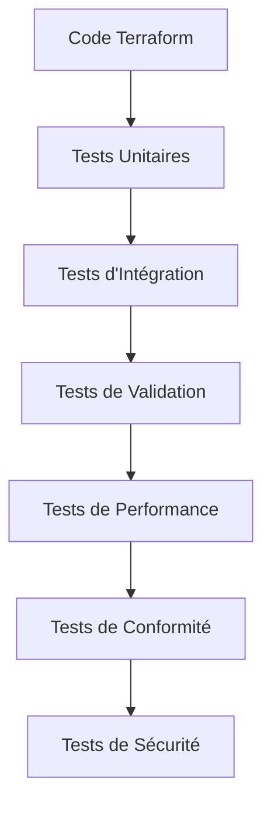
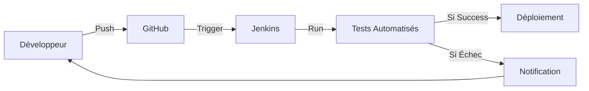

# 🧰 Tests Automatisés

## Introduction

L'automatisation des tests est essentielle pour maintenir la qualité et la fiabilité de l'infrastructure AccessWeaver. Cette documentation décrit notre approche des tests automatisés, les outils utilisés et les meilleures pratiques.

---

## Principes des Tests Automatisés

### Objectifs

- **Éliminer les tests manuels répétitifs**
- **Assurer la cohérence** des tests à travers les environnements
- **Accélérer les cycles** de développement et de déploiement
- **Identifier rapidement** les régressions et problèmes
- **Augmenter la confiance** dans les changements d'infrastructure

### Bénéfices

| Bénéfice | Description |
|------------|-------------|
| **Rapidité** | Exécution des tests en parallèle, réduisant le temps de validation |
| **Cohérence** | Élimination des erreurs humaines et variabilités |
| **Répétabilité** | Tests identiques à chaque exécution |
| **Documentation Vivante** | Les tests automatisés servent de documentation exécutable |
| **Détection Précoce** | Identification des problèmes avant qu'ils n'atteignent la production |

---

## Framework de Test Automatisé

AccessWeaver utilise une architecture de test automatisé en plusieurs couches pour valider l'infrastructure et les applications.

### Architecture de Test



### Niveaux de Tests

| Niveau | Objectif | Outils | Environnement |
|--------|----------|--------|---------------|
| **Unité** | Valider des modules Terraform individuels | Terratest, Unit Tests | Local/CI |
| **Intégration** | Tester les interactions entre modules | Terratest, Scripts | Environnement de test |
| **Validation** | Confirmer le fonctionnement des ressources déployées | AWS SDK, Scripts | Environnement de test |
| **Performance** | Évaluer les performances sous charge | JMeter, k6 | Staging |
| **Conformité** | Vérifier la conformité aux standards | OPA, Checkov | Tous |
| **Sécurité** | Détecter les vulnérabilités | tfsec, Prowler | Tous |

---

## Outils d'Automatisation

### Outils Principaux

- **[Jenkins](https://jenkins.io/)** - Orchestration des pipelines CI/CD
- **[Terratest](https://terratest.gruntwork.io/)** - Tests automatisés pour Terraform
- **[Conftest](https://www.conftest.dev/)** - Tests de politique
- **[Molecule](https://molecule.readthedocs.io/)** - Tests d'Ansible
- **[Inspec](https://community.chef.io/tools/chef-inspec)** - Tests de conformité
- **[Packer](https://www.packer.io/)** - Tests de construction d'images

### Outils de Tests Spécifiques

- **[AWS CloudFormation Guard](https://github.com/aws-cloudformation/cloudformation-guard)** - Validation des templates
- **[Serverspec](https://serverspec.org/)** - Tests d'infrastructure serveur
- **[Kitchen-Terraform](https://github.com/newcontext-oss/kitchen-terraform)** - Framework de test pour Terraform
- **[Goss](https://github.com/aelsabbahy/goss)** - Outil de validation rapide

---

## Processus d'Automatisation

### Workflow d'Automatisation

1. **Déclenchement**
   - Commit dans le dépôt Git
   - Création d'une Pull Request
   - Exécution planifiée (nightly build)
   - Déclenchement manuel

2. **Préparation de l'Environnement**
   - Création d'un environnement éphémère
   - Installation des dépendances
   - Configuration des credentials

3. **Exécution des Tests**
   - Tests unitaires
   - Tests d'intégration
   - Tests de validation
   - Tests de performance (si applicable)

4. **Analyse des Résultats**
   - Génération de rapports
   - Publication des résultats
   - Notification aux équipes

5. **Nettoyage**
   - Destruction des ressources temporaires
   - Archivage des logs et rapports

### Intégration CI/CD



---

## Implémentation

### Structure de Dossier

```
tests/
├── unit/               # Tests unitaires
├── integration/        # Tests d'intégration
├── validation/         # Tests de validation
├── performance/        # Tests de performance
├── compliance/         # Tests de conformité
├── security/           # Tests de sécurité
└── fixtures/           # Données de test
```

### Exemple de Configuration

```yaml
# .jenkins/pipelines/test-automation.yml
pipeline:
  stages:
    - name: "Prepare"
      steps:
        - checkout
        - setup_terraform
        - setup_aws_credentials
        
    - name: "Unit Tests"
      steps:
        - run_terraform_validate
        - run_tflint
        - run_unit_tests
        
    - name: "Security Tests"
      steps:
        - run_tfsec
        - run_checkov
        
    # Autres étapes...
```

---

## Meilleures Pratiques

### Conception des Tests

- **Indépendance** - Chaque test doit fonctionner isolément
- **Idempotence** - Les tests doivent pouvoir s'exécuter plusieurs fois
- **Atomicité** - Tester une seule chose à la fois
- **Self-checking** - Les tests doivent déterminer eux-mêmes s'ils ont réussi
- **Rapide** - Optimiser pour l'exécution rapide

### Organisation

- **Par Fonctionnalité** - Regrouper les tests par fonctionnalité
- **Nommage Clair** - Utiliser des noms descriptifs pour les tests
- **Isolation** - Séparer les environnements de test
- **Tags** - Utiliser des tags pour catégoriser les tests

### Exécution

- **Parallélisation** - Exécuter les tests en parallèle lorsque possible
- **Retry Mechanism** - Réessayer les tests instables
- **Timeouts** - Définir des délais d'expiration raisonnables
- **Skip Logic** - Permettre de sauter certains tests si nécessaire

---

## Surveillance et Reporting

### Tableaux de Bord

- **Dashboard Jenkins** - Statut des pipelines
- **Rapport de Couverture** - Couverture des tests
- **Tendances de Qualité** - Évolution des métriques dans le temps

### Alertes

- **Échecs Critiques** - Notification immédiate sur Slack
- **Tendances Négatives** - Alertes sur dégradation de qualité
- **Temps d'Exécution** - Alertes sur ralentissement des tests

### Métriques

- **Taux de Succès** - Pourcentage de tests réussis
- **Temps d'Exécution** - Durée totale et par test
- **Couverture** - Pourcentage de code/infrastructure couvert
- **Faux Positifs** - Taux d'échecs non pertinents

---

## Exemples de Cas de Test

### Test de Module VPC

1. **Préparation**
   - Créer un module VPC temporaire
   - Définir les sous-réseaux et CIDR

2. **Validation**
   - Vérifier la création des sous-réseaux
   - Valider les tables de routage
   - Vérifier les zones de disponibilité
   - Tester la connexion Internet

3. **Nettoyage**
   - Supprimer toutes les ressources créées

### Test de Sécurité RDS

1. **Préparation**
   - Déployer une instance RDS de test

2. **Validation**
   - Vérifier le chiffrement au repos
   - Valider les paramètres de sécurité
   - Tester les contrôles d'accès
   - Vérifier les backups

3. **Nettoyage**
   - Supprimer l'instance RDS et ressources associées

---

## Troubleshooting

### Problèmes Courants

| Problème | Cause Possible | Solution |
|-----------|----------------|----------|
| **Test instable** | Ressources non nettoyées | Implémenter un nettoyage robuste |
| **Timeouts** | Ressources lentes à créer | Augmenter les délais d'attente |
| **Échecs inattendus** | Dépendances externes | Mock des services externes |
| **Conflit de ressources** | Noms non uniques | Utiliser des préfixes/suffixes aléatoires |

### Bonnes Pratiques de Débogage

- **Logs Détaillés** - Activer les logs verbeux
- **États Intermédiaires** - Conserver les états entre les étapes
- **Tests Isolés** - Exécuter les tests individuellement
- **Environnement Local** - Reproduire les problèmes localement

---

## Ressources

- [Jenkins Documentation](https://www.jenkins.io/doc/)
- [Terratest Documentation](https://terratest.gruntwork.io/docs/)
- [AWS Testing Best Practices](https://aws.amazon.com/blogs/devops/best-practices/)
- [Infrastructure Testing Patterns](https://medium.com/@ernesto.garbarino_10569/infrastructure-as-code-testing-patterns-fc9bf998ec9)
- [Test-Driven Development for IaC](https://www.hashicorp.com/resources/test-driven-development-tdd-for-infrastructure)