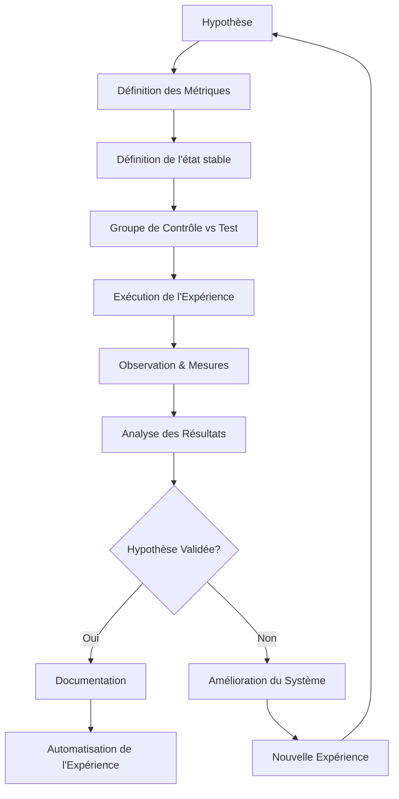
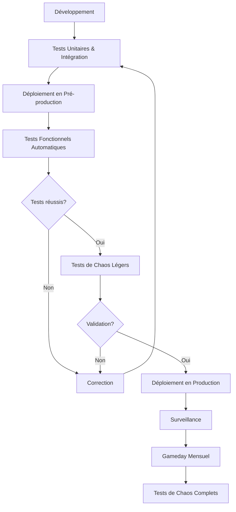
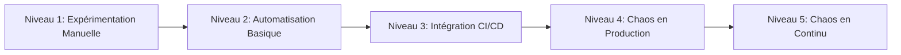

# 🚀 Tests de Chaos

## Introduction

Les tests de chaos constituent une approche proactive pour évaluer la résilience et la robustesse de l'infrastructure et des applications AccessWeaver. En introduisant délibérément des perturbations contrôlées dans notre système, nous pouvons identifier les faiblesses et améliorer la fiabilité globale avant que des incidents réels ne se produisent.

---

## Principes de l'Ingénierie du Chaos

### Objectifs

- **Identifier les faiblesses** des systèmes avant qu'elles n'affectent les utilisateurs
- **Améliorer la résilience** de l'infrastructure et des applications
- **Tester les mécanismes de récupération** et les processus d'urgence
- **Valider les hypothèses** sur le comportement du système sous contrainte
- **Renforcer la confiance** dans les capacités de production

### Principes Fondamentaux

1. **État stable** - Définir ce qu'est un comportement "normal" du système
2. **Hypothèses** - Formuler des hypothèses sur ce comportement face aux perturbations
3. **Expérimentations réelles** - Tester en production ou dans des environnements similaires
4. **Automatisation** - Privilégier l'automatisation pour la cohérence et la reproductibilité
5. **Minimisation de la zone d'impact** - Limiter l'impact des expérimentations
6. **Apprentissage continu** - Tirer des leçons des expériences pour améliorer le système

---

## Types de Tests de Chaos

### 1. Tests d'Infrastructure

| Type | Description | Outils |
|------|-------------|--------|
| **Arrêt d'instances** | Arrêt aléatoire d'instances EC2, conteneurs, pods | AWS Fault Injection Service, Chaos Mesh, Litmus |
| **Dégradation réseau** | Latence, perte de paquets, corruption, partition | Toxiproxy, Pumba, tc |
| **Épuisement de ressources** | CPU, mémoire, disque, IO | Chaos Toolkit, stress-ng |
| **Défaillance de zone/région** | Simulation de panne d'une AZ ou région AWS | AWS Fault Injection Service, scripts personnalisés |

### 2. Tests d'Application

| Type | Description | Outils |
|------|-------------|--------|
| **Latence API** | Injection de latence dans les appels API | Chaos Monkey, Toxiproxy |
| **Échec de service** | Arrêt forcé de services critiques | Chaos Toolkit, ChAP |
| **Corruption de données** | Introduction de données incorrectes ou corrompues | Outils personnalisés, scripts |
| **Surcharge de requêtes** | Tests de charge soudaine, DDoS simulé | Gatling, Locust, Vegeta |

### 3. Tests de Dépendances

| Type | Description | Outils |
|------|-------------|--------|
| **Panne de base de données** | Arrêt ou ralentissement des bases de données | Chaos Toolkit, AWS FIS |
| **Échec de service externe** | Simulation d'échec des API tierces | Toxiproxy, Wiremock |
| **Latence de dépendance** | Ralentissement des services externes | Istio, Toxiproxy |
| **Limitation de débit** | Réduction de la bande passante vers des services externes | tc, AWS Network Firewall |

---

## Outils et Technologies

### Plateformes de Tests de Chaos

- **[Chaos Monkey](https://github.com/Netflix/chaosmonkey)** - Outil de Netflix pour tester la résilience
- **[Chaos Toolkit](https://chaostoolkit.org/)** - Framework extensible pour l'ingénierie du chaos
- **[Litmus](https://litmuschaos.io/)** - Plateforme de chaos pour Kubernetes
- **[Chaos Mesh](https://chaos-mesh.org/)** - Plateforme cloud native pour Kubernetes
- **[Gremlin](https://www.gremlin.com/)** - Solution commerciale de tests de chaos

### Outils AWS

- **[AWS Fault Injection Service (FIS)](https://aws.amazon.com/fis/)** - Service natif AWS pour les tests de chaos
- **[AWS Fault Injection Simulator](https://aws.amazon.com/fis/)** - Simulation d'événements de défaillance
- **[SSM Chaos Runner](https://github.com/amzn/awsssmchaosrunner)** - Tests de chaos via AWS Systems Manager

### Outils de Surveillance

- **[CloudWatch](https://aws.amazon.com/cloudwatch/)** - Surveillance des ressources AWS
- **[Prometheus](https://prometheus.io/)** - Surveillance et alerting
- **[Grafana](https://grafana.com/)** - Visualisation des métriques
- **[AWS X-Ray](https://aws.amazon.com/xray/)** - Analyse et débogage

---

## Mise en Œuvre

### Framework d'Expérimentation de Chaos



### Méthodologie des Gamedays

1. **Préparation**
   - Définir les objectifs et hypothèses
   - Identifier les participants et rôles
   - Préparer les scenarios et scripts
   - Établir des critères d'arrêt d'urgence

2. **Exécution**
   - Séance d'information préliminaire
   - Exécution des scénarios de chaos
   - Surveillance en temps réel
   - Prise de notes et observations

3. **Analyse**
   - Débriefing immédiat
   - Analyse détaillée des résultats
   - Documentation des observations
   - Identification des améliorations

---

## Scénarios de Tests de Chaos

### Scénario 1: Perte d'Instance EC2

```yaml
# AWS FIS Experiment: EC2 Termination
name: "EC2-Instance-Termination-Test"
description: "Test the system's resilience to EC2 instance failures"
stopConditions:
  - source: aws:cloudwatch:alarm
    value: arn:aws:cloudwatch:us-east-1:123456789012:alarm:HighErrorRate
actions:
  terminateInstances:
    actionId: aws:ec2:terminate-instances
    parameters:
      instanceIds: ["i-1234567890abcdef0"]
    targets:
      instances: ["arn:aws:ec2:us-east-1:123456789012:instance/i-1234567890abcdef0"]
targets:
  instances:
    resourceType: aws:ec2:instance
    resourceTags:
      Application: ["AccessWeaver"]
      Environment: ["Test"]
    filters:
      - path: "State.Name"
        values: ["running"]
    selectionMode: "COUNT(1)"
roleArn: "arn:aws:iam::123456789012:role/FISExecutionRole"
```

### Scénario 2: Latence dans la Base de Données

```java
// Exemple d'implémentation Java 21 pour le test de chaos avec Chaos Toolkit
public class DatabaseLatencyExperiment {
    public static void main(String[] args) throws Exception {
        // Configuration du test de chaos
        var experiment = Map.of(
            "version", "1.0.0",
            "title", "Database latency impact on application performance",
            "description", "Inject latency to RDS and observe application behavior",
            "tags", List.of("database", "latency", "resilience"),
            "steady-state-hypothesis", Map.of(
                "title", "Application remains responsive",
                "probes", List.of(
                    Map.of(
                        "name", "api-responsiveness",
                        "type", "probe",
                        "tolerance", 200,
                        "provider", Map.of(
                            "type", "http",
                            "url", "https://api.accessweaver.com/health",
                            "timeout", 3
                        )
                    )
                )
            ),
            "method", List.of(
                Map.of(
                    "type", "action",
                    "name", "inject-db-latency",
                    "provider", Map.of(
                        "type", "process",
                        "path", "aws",
                        "arguments", List.of("fis", "start-experiment", "--experiment-template-id", "db-latency-template")
                    )
                ),
                Map.of(
                    "type", "probe",
                    "name", "verify-response-times",
                    "provider", Map.of(
                        "type", "process",
                        "path", "./scripts/measure_latency.sh",
                        "arguments", List.of("--endpoint", "https://api.accessweaver.com/v1/policies", "--duration", "300")
                    )
                )
            ),
            "rollbacks", List.of(
                Map.of(
                    "type", "action",
                    "name", "remove-db-latency",
                    "provider", Map.of(
                        "type", "process",
                        "path", "aws",
                        "arguments", List.of("fis", "stop-experiment", "--id", "${experiment-id}")
                    )
                )
            )
        );
        
        // Exécution de l'expérience via l'API Chaos Toolkit
        var chaosToolkit = new ChaosToolkitClient();
        var results = chaosToolkit.runExperiment(experiment);
        
        // Analyse des résultats
        results.getJournal().forEach(System.out::println);
    }
}
```

### Scénario 3: Perte de Zone de Disponibilité

```yaml
# Chaos Mesh Experiment: AZ Failure Simulation
apiVersion: chaos-mesh.org/v1alpha1
kind: NetworkChaos
metadata:
  name: az-failure-simulation
  namespace: accessweaver
spec:
  action: partition
  mode: all
  selector:
    namespaces:
      - accessweaver-prod
    labelSelectors:
      'aws-az': 'us-east-1a'
  direction: to
  target:
    selector:
      namespaces:
        - accessweaver-prod
      labelSelectors:
        'aws-az': 'us-east-1b,us-east-1c'
    mode: all
  duration: '10m'
  scheduler:
    cron: '@every 30d'
```

---

## Intégration dans le CI/CD

### Pipeline de Tests de Chaos



### Processus d'Intégration Continue

1. **Développement**
   - Les ingénieurs implémentent de nouvelles fonctionnalités
   - Tests unitaires et d'intégration exécutés localement

2. **Intégration**
   - Fusion dans la branche principale
   - Exécution de tests automatiques
   - Construction des artefacts

3. **Déploiement en environnement de test**
   - Déploiement automatique
   - Tests d'intégration avancés
   - **Tests de chaos légers**

4. **Déploiement en production**
   - Déploiement canary ou blue/green
   - Surveillance intensive
   - Exécution périodique de tests de chaos complets

---

## Meilleures Pratiques

### Sécurité des Tests de Chaos

- **Minimiser l'impact** - Limiter la portée des expériences
- **Surveillance accrue** - Mettre en place une surveillance intensive pendant les tests
- **Mécanisme d'arrêt d'urgence** - Pouvoir arrêter immédiatement une expérience
- **Notifications** - Informer les parties prenantes avant les tests
- **Contrôle d'accès** - Limiter qui peut lancer des tests de chaos

### Conception des Expériences

- **Commencer petit** - Débuter par des expériences à faible impact
- **Incrémentalité** - Augmenter progressivement la complexité et l'impact
- **Hypothèses claires** - Définir précisément ce qui est testé
- **Métriques pertinentes** - S'assurer de mesurer les bons indicateurs
- **Reproductibilité** - Concevoir des expériences reproductibles

### Établissement d'une Culture du Chaos

- **Soutien de la direction** - Obtenir l'appui des responsables
- **Formation** - Éduquer les équipes sur l'ingénierie du chaos
- **Apprentissage sans blâme** - Se concentrer sur les leçons, pas les erreurs
- **Célébrer les échecs** - Valoriser la découverte des faiblesses
- **Documentation** - Partager les connaissances acquises

---

## Surveillance et Reporting

### Métriques Clés

| Catégorie | Métriques |
|------------|------------|
| **Disponibilité** | Uptime, SLA/SLO, taux d'erreur |
| **Performance** | Latence, débit, saturation des ressources |
| **Résilience** | MTTR, MTBF, taux de récupération |
| **Expériences** | Nombre d'expériences, taux de succès, couverture |

### Tableaux de Bord

- **Tableau de bord de résilience** - Suivi des métriques de résilience globale
- **Tableau de bord d'expérimentation** - Suivi des expériences en cours et passées
- **Tableau de bord d'incident** - Visualisation des incidents et récupérations

### Rapports

- **Rapport post-expérience** - Détail des résultats et observations
- **Rapport mensuel de résilience** - Évolution de la résilience du système
- **Rapport de Gameday** - Résumé des activités et leçons apprises

---

## Évolution de la Stratégie de Chaos

### Niveaux de Maturité



1. **Niveau 1: Expérimentation Manuelle**
   - Tests manuels occassionnels
   - Gamdays planifiés
   - Environnements contrôlés

2. **Niveau 2: Automatisation Basique**
   - Scripts automatisés
   - Tests planifiés
   - Métriques de base

3. **Niveau 3: Intégration CI/CD**
   - Tests de chaos dans les pipelines
   - Environnements de pré-production
   - Métriques avancées

4. **Niveau 4: Chaos en Production**
   - Tests de chaos en production
   - Impact limité et ciblé
   - Surveillance avancée

5. **Niveau 5: Chaos en Continu**
   - Chaos Engineering comme service
   - Tests continus 24/7
   - Auto-guérison des systèmes

### Feuille de Route

| Phase | Objectifs | Échéance |
|-------|-----------|----------|
| **Initiation** | Établir framework, premiers gamedays | T0 + 3 mois |
| **Fondation** | Automatisation, intégration CI/CD | T0 + 6 mois |
| **Expansion** | Couverture élargie, tests en prod limités | T0 + 12 mois |
| **Maturité** | Chaos en production, auto-guérison | T0 + 18 mois |

---

## Études de Cas

### Étude de Cas 1: Récupération de Base de Données

**Scénario**: Simulation de corruption de données dans RDS

**Découverte**: Le processus de restauration automatique prenait trop de temps

**Amélioration**: 
- Implémentation d'une stratégie de sauvegarde incrémentielle
- Automatisation de la vérification d'intégrité
- Réduction du RTO de 45 à 15 minutes

### Étude de Cas 2: Perte de Zone de Disponibilité

**Scénario**: Simulation de panne complète d'une AZ AWS

**Découverte**: Certains services n'avaient pas de failover automatique

**Amélioration**:
- Refactorisation pour un déploiement multi-AZ complet
- Amélioration des health checks
- Configuration d'auto-scaling cross-AZ

---

## Ressources

### Documentation

- [Principes d'Ingénierie du Chaos](https://principlesofchaos.org/)
- [AWS Fault Injection Service](https://docs.aws.amazon.com/fis/latest/userguide/what-is.html)
- [Chaos Engineering (O'Reilly)](https://www.oreilly.com/library/view/chaos-engineering/9781492043867/)

### Communauté

- [Chaos Community](https://chaos.community/)
- [Chaos Engineering Slack](https://chaosengineering.slack.com/)
- [Gremlin Community](https://www.gremlin.com/community/)

### Formations

- [Chaos Engineering Certification](https://www.gremlin.com/chaos-engineering-certification/)
- [AWS Re:invent Sessions on Chaos](https://aws.amazon.com/blogs/architecture/chaos-engineering-with-aws-fault-injection-simulator-and-aws-systems-manager/)
- [Chaos Conf](https://chaosconf.io/)