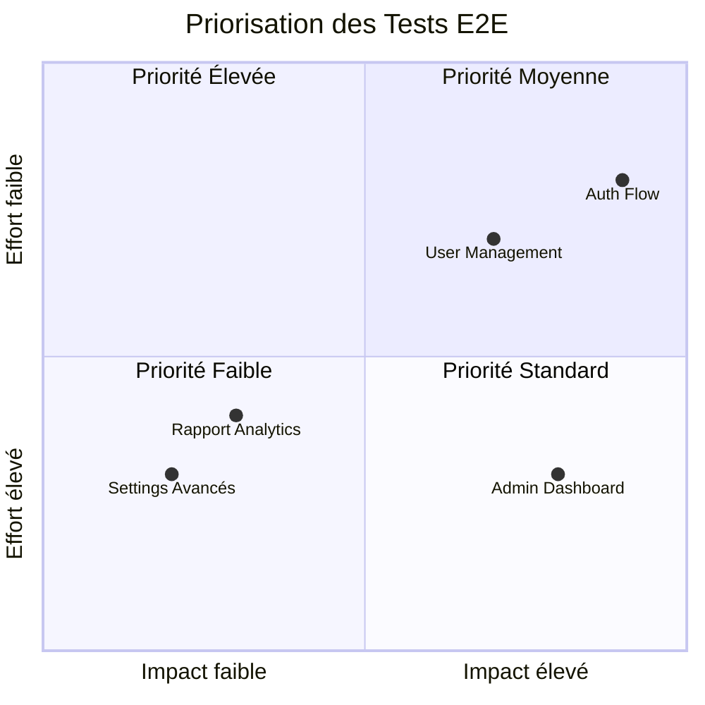
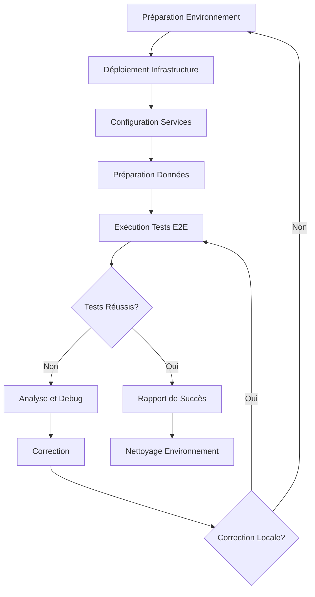

# 🔧 Tests End-to-End (E2E)

## Introduction

Les tests End-to-End (E2E) valident le fonctionnement complet de l'infrastructure et des applications AccessWeaver dans des conditions proches de la production. Cette documentation décrit notre approche, méthodologies, et bonnes pratiques pour les tests E2E.

---

## Principes des Tests E2E

### Objectifs

- **Valider les parcours utilisateur** complets de bout en bout
- **Vérifier l'intégrité** de tous les composants ensemble
- **Confirmer le bon fonctionnement** dans des conditions réelles
- **Détecter les problèmes** d'intégration complexes
- **Valider les performances** du système global

### Portée

| Aspect | Description |
|--------|-------------|
| **Système Complet** | Tests sur l'ensemble de la stack technique |
| **Multi-Service** | Tests à travers tous les microservices |
| **Infrastructure** | Validation de toute l'infrastructure déployée |
| **UX/UI** | Test des interfaces utilisateur (si applicable) |
| **API Externes** | Intégrations avec services externes |

---

## Stratégie de Test E2E

### Types de Tests E2E

| Type | Description | Exemple |
|------|-------------|----------|
| **Parcours Utilisateur** | Simulation des actions utilisateur | Création et vérification d'une politique d'accès |
| **Tests de Régression** | Vérification non-régression fonctionnelle | Validation des fonctionnalités existantes |
| **Tests de Compatibilité** | Tests multi-environnement | Fonctionnement sur différentes configurations |
| **Tests de Sécurité E2E** | Sécurité à l'échelle du système | Tests de pénétration de bout en bout |
| **Tests de Performance** | Comportement sous charge réelle | Tests de charge, stress, endurance |

### Prioritisation

Nous utilisons l'approche RICE pour prioriser nos tests E2E :

- **Reach** - Nombre d'utilisateurs affectés
- **Impact** - Impact sur l'expérience utilisateur
- **Confidence** - Niveau de confiance dans l'estimation
- **Effort** - Ressources nécessaires pour le test



---

## Outils et Technologies

### Frameworks de Test E2E

- **[Selenium](https://www.selenium.dev/)** - Tests UI automatisés
- **[Playwright](https://playwright.dev/)** - Tests navigateur modernes
- **[REST Assured](https://rest-assured.io/)** - Tests API REST en Java 21
- **[Cypress](https://www.cypress.io/)** - Tests frontend modernes
- **[Gatling](https://gatling.io/)** - Tests de performance

### Outils de Support

- **[TestContainers](https://www.testcontainers.org/)** - Environnements de test en conteneurs
- **[Allure](https://docs.qameta.io/allure/)** - Reporting de tests
- **[AWS Device Farm](https://aws.amazon.com/device-farm/)** - Tests sur différents appareils
- **[Postman](https://www.postman.com/)** - Collections API E2E
- **[ELK Stack](https://www.elastic.co/elastic-stack)** - Analyse des logs de test

---

## Mise en Œuvre

### Structure des Tests E2E

```
tests/e2e/
├── workflows/               # Tests de parcours utilisateur
│   ├── auth/                # Tests d'authentification
│   ├── admin/               # Tests administration
│   └── services/            # Tests services métier
├── api/                    # Tests API de bout en bout
│   ├── public/              # API publiques
│   └── internal/            # API internes
├── infra/                  # Tests infrastructure complète
│   ├── availability/        # Tests de disponibilité
│   └── deployment/          # Tests de déploiement
├── performance/            # Tests de performance E2E
└── fixtures/               # Données de test E2E
```

### Exemple de Test E2E en Java 21

```java
@E2ETest
public class AuthorizationFlowE2ETest {

    @RegisterExtension
    static final InfrastructureExtension infra = new FullStackInfrastructure();
    
    private RestApiClient apiClient;
    private TestUser adminUser;
    private TestUser regularUser;
    
    @BeforeEach
    void setUp() {
        apiClient = new RestApiClient(infra.getApiGatewayUrl());
        adminUser = TestUsers.createAdminUser();
        regularUser = TestUsers.createRegularUser();
    }
    
    @Test
    void completeAuthorizationFlow() {
        // 1. Admin crée une nouvelle politique
        var authToken = apiClient.login(adminUser);
        var policyId = apiClient.createPolicy(authToken, 
            new PolicyRequest("finance-data", "read"));
        assertNotNull(policyId, "La politique devrait être créée");
        
        // 2. Admin assigne la politique à l'utilisateur
        var assignmentResult = apiClient.assignPolicy(authToken, 
            regularUser.getId(), policyId);
        assertTrue(assignmentResult.isSuccess());
        
        // 3. Utilisateur essaie d'accéder à la ressource
        var userToken = apiClient.login(regularUser);
        var accessResult = apiClient.accessResource(userToken, 
            "finance-data", "read");
        assertTrue(accessResult.isAllowed());
        
        // 4. Vérification des logs d'audit
        var auditLogs = apiClient.getAuditLogs(authToken, regularUser.getId());
        assertTrue(auditLogs.contains("finance-data"));
        assertTrue(auditLogs.contains("read"));
        assertTrue(auditLogs.contains("allowed"));
    }
}
```

---

## Environnements de Test E2E

### Configuration d'Environnement

| Environnement | Description | Utilisation |
|---------------|-------------|-------------|
| **Pre-production** | Clone de production avec données synthétiques | Tests E2E principaux |
| **Staging** | Environnement de validation avant production | Tests de validation |
| **Sandbox** | Environnement isolé et configurable | Tests spécifiques |
| **Production Simulée** | Réplique de production avec charge simulée | Tests de performance |

### Gestion des Données

- **Génération de données** - Création de données de test réalistes
- **Data seeding** - Préparation des données avant les tests
- **Isolation** - Séparation des jeux de données par test
- **Nettoyage** - Restauration de l'état initial après les tests

---

## Processus de Test E2E

### Workflow



### Cycle de Tests

1. **Configuration**
   - Déploiement complet de l'infrastructure
   - Déploiement de tous les services
   - Mise en place des données de test

2. **Exécution**
   - Exécution des scénarios de test
   - Collecte des métriques et logs
   - Surveillance des ressources et performances

3. **Analyse**
   - Évaluation des résultats
   - Diagnostic des échecs
   - Génération de rapports détaillés

4. **Maintenance**
   - Mise à jour des tests selon l'évolution du système
   - Optimisation des scénarios existants
   - Ajout de nouveaux cas de test

---

## Intégration dans le CI/CD

### Pipeline E2E

```yaml
# .jenkins/pipelines/e2e-tests.yml
pipeline:
  stages:
    - name: "Deploy Test Environment"
      steps:
        - checkout
        - terraform_init
        - terraform_apply "e2e-environment"
        - deploy_services
        
    - name: "Prepare Test Data"
      steps:
        - initialize_databases
        - seed_test_data
        - configure_services
        
    - name: "Run E2E Tests"
      steps:
        - run_api_tests
        - run_ui_tests
        - run_workflow_tests
        - run_performance_tests
        
    - name: "Analyze & Report"
      steps:
        - generate_allure_report
        - publish_test_results
        - notify_teams
        
    - name: "Cleanup"
      steps:
        - cleanup_data
        - terraform_destroy
```

### Orchestration

- **Tests nocturnes** - Exécution complète pendant la nuit
- **Tests de recette** - Exécution avant déploiement en production
- **Tests de non-régression** - Après les changements majeurs
- **Tests manuels guidés** - Pour scénarios complexes spécifiques

---

## Meilleures Pratiques

### Conception des Tests

- **Scénarios réalistes** - Tests basés sur de vrais cas d'utilisation
- **Indépendance** - Tests pouvant s'exécuter de manière isolée
- **Résilience** - Gestion des conditions instables
- **Maintenabilité** - Structure claire et documentation
- **Atomicité** - Chaque test vérifie une chose précise

### Exécution Efficace

- **Parallélisation** - Exécution simultanée quand possible
- **Retries stratégiques** - Réessayer les tests instables
- **Optimisation des ressources** - Utilisation efficace du cloud
- **Screenshots et vidéos** - Capture des échecs pour analyse

### Bonnes Pratiques Java 21

- **Utilisation des Records** - Pour les DTO et data classes
- **Pattern Matching** - Pour un code de test plus concis
- **Text Blocks** - Pour les payloads JSON/XML lisibles
- **API Concurrence Moderne** - Pour les tests parallèles
- **Virtual Threads** - Pour les opérations I/O intensives

```java
// Exemple Java 21 - utilisation des fonctionnalités modernes
public record TestCase(String name, String description, List<String> steps) {}

var testCases = List.of(
    new TestCase("auth-flow", "Test du flux d'authentification", 
        List.of("login", "create-policy", "assign-policy")),
    new TestCase("user-mgmt", "Test de gestion utilisateur", 
        List.of("create-user", "update-user", "delete-user"))
);

// Avec Virtual Threads et API moderne
testCases.forEach(testCase -> Thread.startVirtualThread(() -> {
    System.out.println("Exécution du test: %s".formatted(testCase.name()));
    TestResult result = runTest(testCase);
    switch (result) {
        case Success s -> reportSuccess(s);
        case Failure f when f.isRetryable() -> scheduleRetry(f);
        case Failure f -> reportFailure(f);
    }
}));
```

---

## Surveillance et Reporting

### Visualisation

- **Allure Dashboard** - Rapports interactifs des tests
- **Grafana Dashboards** - Visualisation des métriques de test
- **ELK pour logs** - Analyse des logs de test
- **Heatmaps** - Identification des points chauds

### Métriques Clés

- **Taux de réussite** - % de scénarios réussis
- **Temps d'exécution** - Durée des tests E2E
- **Taux de découverte** - Bugs trouvés par les tests E2E
- **Couverture fonctionnelle** - % des fonctionnalités couvertes
- **Stabilité** - Constance des résultats de test

---

## Troubleshooting

### Problèmes Courants

| Problème | Cause Possible | Solution |
|-----------|----------------|----------|
| **Tests instables** | Conditions de course, timeouts | Retries, attentes explicites, synchronisation |
| **Faux positifs** | Conditions environnementales | Isolation, données de test cohérentes |
| **Lenteur des tests** | Tests séquentiels, opérations inefficaces | Parallélisation, optimisation |
| **Échecs intermittents** | Dépendances externes | Mocking, retries, meilleure isolation |

### Bonnes Pratiques de Débogage

- **Rapport détaillé** - Logs, screenshots, vidéos
- **Isolation des échecs** - Reproduction en isolation
- **Analyse des tendances** - Identification des patterns
- **Surveillance système** - Métriques système pendant les tests

---

## Ressources

- [Testing Java Microservices](https://www.manning.com/books/testing-java-microservices)
- [Practical E2E Testing with Selenium](https://www.selenium.dev/documentation/en/)
- [AWS Testing Best Practices](https://aws.amazon.com/blogs/devops/best-practices-for-testing-on-aws/)
- [Modern Java Testing Techniques](https://blog.jetbrains.com/idea/2020/09/java-testing-techniques/)