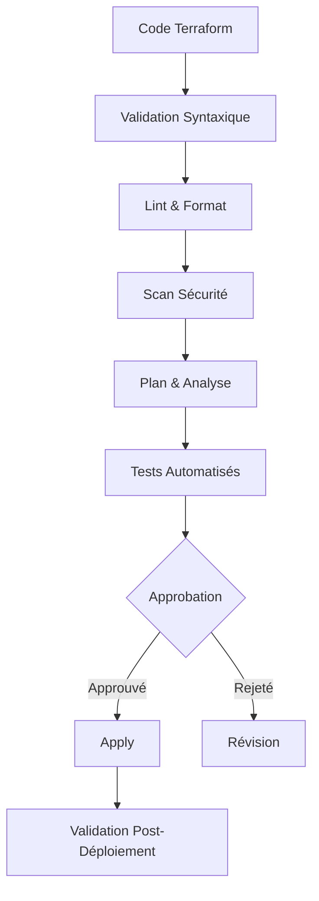

# 🏗️ Tests d'Infrastructure

## Introduction

Les tests d'infrastructure sont essentiels pour valider la fiabilité, la sécurité et la conformité de notre infrastructure AWS provisionnée via Terraform. Ils assurent que les ressources déployées correspondent aux spécifications attendues et respectent les bonnes pratiques.

---

## Principes de Test d'Infrastructure

### Objectifs

- Valider la **conformité** de l'infrastructure avec les spécifications
- Assurer la **cohérence** entre les environnements
- Vérifier le respect des **bonnes pratiques** AWS
- Détecter les **dérives** d'infrastructure
- Valider les **modifications** avant le déploiement en production

### Types de Tests

| Type | Description | Outil | Fréquence |
|------|-------------|-------|----------|
| **Validation Terraform** | Vérification syntaxique des fichiers HCL | `terraform validate` | À chaque commit |
| **Lint Infrastructure** | Application des standards de code | `tflint` | À chaque commit |
| **Plan Analysis** | Analyse des changements d'infrastructure | `terraform plan` | À chaque PR |
| **Security Scanning** | Détection de vulnérabilités | `tfsec`, `checkov` | À chaque PR |
| **Compliance Testing** | Vérification du respect des règles | `OPA`, `conftest` | À chaque PR |
| **Drift Detection** | Détection des modifications manuelles | Scripts personnalisés | Quotidien |

---

## Outils de Test d'Infrastructure

### Outils Natifs Terraform

- **terraform validate** - Validation syntaxique et logique
- **terraform plan** - Prévision des changements d'infrastructure
- **terraform console** - Évaluation des expressions

### Outils Tiers

- **[TFLint](https://github.com/terraform-linters/tflint)** - Linter pour Terraform
- **[Checkov](https://github.com/bridgecrewio/checkov)** - Analyse statique pour IaC
- **[TFSec](https://github.com/aquasecurity/tfsec)** - Scanner de sécurité pour Terraform
- **[Terratest](https://github.com/gruntwork-io/terratest)** - Framework de test en Go
- **[Open Policy Agent (OPA)](https://www.openpolicyagent.org/)** - Vérification de conformité

---

## Stratégie de Test

### 1. Tests Locaux (Pre-commit)

Exécutés par les développeurs avant de soumettre du code :

```bash
# Tests pré-commit automatisés via hooks
make infrastructure-test-local
```

Ces tests incluent :
- Validation syntaxique
- Linting du code Terraform
- Vérifications de formatage
- Scans de sécurité basiques

### 2. Tests CI (Pipeline)

Exécutés automatiquement sur chaque Pull Request :

- **Plan d'Infrastructure** - Visualisation des changements
- **Scan de Sécurité Approfondi** - Détection des vulnérabilités
- **Analyse des Coûts** - Estimation de l'impact financier
- **Tests de Conformité** - Vérification des politiques

### 3. Tests de Non-Régression

Exécutés avant les déploiements majeurs :

- **Déploiement en Environnement de Test** - Validation dans un environnement isolé
- **Vérification des Ressources** - Confirmation de la création correcte
- **Validation des Connexions** - Test des liaisons entre services

### 4. Monitoring Continu

Exécutés en permanence sur l'infrastructure déployée :

- **Détection de Drift** - Identification des écarts entre le code et l'état réel
- **Scans de Conformité** - Vérification continue des politiques
- **Alertes Automatiques** - Notification en cas de problème

---

## Procédures de Test

### Test de Module Terraform

1. **Préparation**
   - Créer un environnement de test isolé
   - Définir les variables d'entrée

2. **Exécution**
   - Déployer le module avec Terratest
   - Valider les ressources créées
   - Vérifier les outputs

3. **Nettoyage**
   - Destruction automatique des ressources de test

### Test de Déploiement Complet

1. **Plan et Analyse**
   - Générer un plan Terraform complet
   - Analyser les changements prévus

2. **Déploiement de Test**
   - Déployer dans un environnement de staging
   - Exécuter des tests d'intégration

3. **Validation**
   - Vérifier la conformité des ressources
   - Valider les connexions entre services

---

## Meilleures Pratiques

### Structure des Tests

- **Un Test par Fonctionnalité** - Isoler les tests pour faciliter le diagnostic
- **Tests Idempotents** - Les tests doivent pouvoir être exécutés plusieurs fois
- **Automatisation Complète** - Aucune intervention manuelle nécessaire

### Documentation des Tests

- **Documenter le But** - Expliquer l'objectif de chaque test
- **Documenter les Préconditions** - Spécifier les conditions requises
- **Documenter les Résultats Attendus** - Définir les critères de succès

### Gestion des Environnements

- **Isolation des Tests** - Utiliser des environnements dédiés
- **Noms Uniques** - Éviter les conflits de ressources
- **Nettoyage Automatique** - Détruire les ressources après les tests

---

## Intégration dans le CI/CD

### Pipeline Terraform



### Gestion des Échecs

- **Notification Immédiate** - Alerte des équipes concernées
- **Rollback Automatique** - Retour à l'état précédent si possible
- **Rapport Détaillé** - Informations précises sur la cause de l'échec

---

## Métriques et Rapports

### Indicateurs Clés

- **Taux de Couverture** - Pourcentage de ressources testées
- **Taux de Réussite** - Pourcentage de tests réussis
- **Temps d'Exécution** - Durée des tests
- **Vulnérabilités Détectées** - Nombre et sévérité

### Rapports

- **Rapport de Test** - Résumé des tests exécutés
- **Rapport de Conformité** - État de conformité de l'infrastructure
- **Rapport de Sécurité** - Vulnérabilités et recommandations
- **Rapport de Drift** - Écarts entre le code et l'infrastructure réelle

---

## Ressources

- [Documentation Terraform Testing](https://developer.hashicorp.com/terraform/tutorials/configuration-language/test)
- [Terratest Documentation](https://terratest.gruntwork.io/docs/)
- [AWS Well-Architected Framework](https://aws.amazon.com/architecture/well-architected/)
- [Terraform Best Practices](https://www.terraform-best-practices.com/)