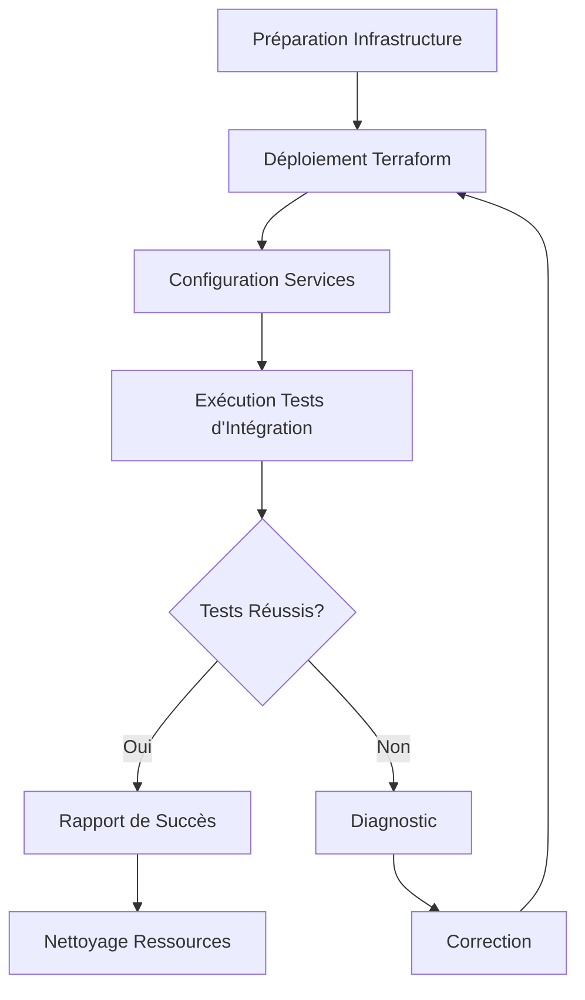

# 🔄 Tests d'Intégration

## Introduction

Les tests d'intégration valident les interactions entre différents composants d'infrastructure et services d'AccessWeaver. Cette documentation détaille notre approche des tests d'intégration, les méthodologies, et les meilleures pratiques.

---

## Principes des Tests d'Intégration

### Objectifs

- **Valider les interactions** entre composants d'infrastructure
- **Vérifier la connectivité** entre les services
- **Tester les flux de données** à travers les différentes couches
- **Confirmer le bon fonctionnement** des intégrations AWS
- **Identifier les problèmes** qui n'apparaissent qu'en combinant les composants

### Portée

| Portée | Composants | Exemples |
|--------|------------|----------|
| **Intra-Module** | Composants dans un même module | RDS + Secrets Manager |
| **Inter-Module** | Composants entre différents modules | ECS + ALB + VPC |
| **Service-à-Service** | Interactions entre microservices | API Gateway + Lambda |
| **Infrastructure-Application** | Interaction infra-application | Java 21 Microservices + AWS Resources |
| **Multi-Environnement** | Composants dans différents environnements | VPC Peering, Cross-Region |

---

## Stratégie de Test d'Intégration

### Approche Méthodologique

1. **Bottom-Up**
   - Tester d'abord les intégrations de bas niveau
   - Ajouter progressivement des composants plus complexes
   - Exemple: DB → Service → API → Frontend

2. **Top-Down**
   - Commencer par les API de haut niveau
   - Simuler les composants qui ne sont pas encore testés
   - Exemple: API → Mock Service → Mock DB

3. **Sandwich (Hybride)**
   - Combiner les approches bottom-up et top-down
   - Prioriser les interfaces critiques

### Catégories de Tests

| Catégorie | Description | Exemple |
|-----------|-------------|----------|
| **Connectivité** | Valider les connexions réseau | VPC → RDS |
| **Autorisation** | Vérifier les permissions IAM | ECS Task → S3 |
| **Data Flow** | Suivre les flux de données | SNS → SQS → Lambda |
| **Résilience** | Tester la tolérance aux pannes | Multi-AZ, Failover |
| **Configuration** | Valider les paramètres | Parameter Store → App |

---

## Outils et Technologies

### Frameworks de Test

- **[Terratest](https://terratest.gruntwork.io/)** - Tests d'infrastructure en Go
- **[Localstack](https://localstack.cloud/)** - Émulation AWS locale
- **[Testcontainers](https://www.testcontainers.org/)** - Conteneurs pour tests Java 21
- **[WireMock](https://wiremock.org/)** - Mocking HTTP pour tests d'API
- **[Pact](https://pact.io/)** - Tests de contrat consommateur-fournisseur

### Outils de Surveillance

- **[AWS X-Ray](https://aws.amazon.com/xray/)** - Traçage distribué
- **[Jaeger](https://www.jaegertracing.io/)** - Traçage des transactions
- **[Prometheus](https://prometheus.io/)** - Monitoring et alerting
- **[CloudWatch Synthetics](https://docs.aws.amazon.com/AmazonCloudWatch/latest/monitoring/CloudWatch_Synthetics_Canaries.html)** - Tests synthétiques

---

## Mise en Œuvre

### Structure des Tests

```
tests/integration/
├── aws/                      # Tests d'intégration AWS
│   ├── vpc_connectivity/     # Tests de connectivité VPC
│   ├── db_service/           # Tests d'intégration Base de données
│   └── security_groups/      # Tests de groupes de sécurité
├── microservices/            # Tests entre microservices
│   ├── api_gateway/          # Tests d'API Gateway
│   ├── service_to_service/   # Tests inter-services
│   └── data_flow/            # Tests de flux de données
└── external/                 # Tests d'intégrations externes
    ├── third_party_apis/     # Tests d'API tierces
    └── cloud_services/       # Tests de services cloud
```

### Exemple de Test d'Intégration

```java
// Test d'intégration entre ECS et RDS en Java 21
@IntegrationTest
public class EcsRdsIntegrationTest {

    @Test
    public void testEcsServiceCanConnectToDatabase() {
        // Déployer l'infrastructure temporaire
        var infraDeployer = new InfrastructureDeployer("integration-test");
        var resources = infraDeployer.deploy();
        
        try {
            // Vérifier la connectivité
            var ecsService = resources.getEcsService();
            var rdsEndpoint = resources.getRdsEndpoint();
            
            // Exécuter un test de connectivité via ECS exec
            var result = ecsService.executeCommand(
                "pg_isready -h " + rdsEndpoint);
                
            // Vérifier le résultat
            assertThat(result.getExitCode()).isEqualTo(0);
            assertThat(result.getOutput()).contains("accepting connections");
        } finally {
            // Nettoyer les ressources
            infraDeployer.destroy();
        }
    }
}
```

---

## Environnements de Test

### Types d'Environnements

| Type | Description | Avantages | Inconvénients |
|------|-------------|-----------|---------------|
| **Local** | Tests sur machine locale avec émulateurs | Rapide, pas de coûts | Fidélité limitée |
| **Sandbox** | Environnement AWS isolé | Réaliste, sécurisé | Coûts, configuration |
| **Staging** | Réplique de production | Haute fidélité | Coûts élevés, complexité |
| **Hybrid** | Combinaison local/cloud | Flexible, économique | Configuration complexe |

### Configuration des Environnements

- **Isolation réseau** pour éviter les interférences
- **Infrastructure éphémère** créée pour chaque série de tests
- **Credentials temporaires** avec privilèges minimaux
- **Préfixes/suffixes uniques** pour éviter les conflits de ressources
- **Limites de coûts** et mécanismes de nettoyage automatisés

---

## Processus de Test

### Workflow



### Cycle de Tests

1. **Préparation**
   - Définir les ressources nécessaires
   - Préparer les données de test
   - Configurer les crédentials

2. **Déploiement**
   - Provisionner l'infrastructure temporaire
   - Configurer les services et applications
   - Vérifier le déploiement correct

3. **Exécution**
   - Exécuter les tests d'intégration
   - Collecter les métriques et logs
   - Surveiller l'exécution

4. **Analyse**
   - Vérifier les résultats des tests
   - Analyser les échecs
   - Générer des rapports

5. **Nettoyage**
   - Détruire les ressources temporaires
   - Archiver les résultats et logs
   - Libérer les ressources

---

## Meilleures Pratiques

### Conception des Tests

- **Privilégier l'autonomie** - Tests auto-suffisants
- **Réduire la portée** - Limiter le nombre de composants par test
- **Idempotence** - Les tests doivent pouvoir s'exécuter plusieurs fois
- **Parallélisation** - Concevoir pour l'exécution parallèle
- **Gestion des états** - Créer un état initial connu

### Gestion des Données

- **Données synthétiques** - Générer des données de test
- **Isolation des données** - Éviter les interférences
- **Nettoyage complet** - Supprimer toutes les données de test
- **Gestion des secrets** - Utiliser des mécanismes sécurisés

### Performance et Fiabilité

- **Timeouts adaptés** - Configurer des délais raisonnables
- **Retry logic** - Gérer les échecs transitoires
- **Circuit breakers** - Éviter les cascades d'échecs
- **Logging détaillé** - Faciliter le diagnostic

---

## Intégration CI/CD

### Pipeline d'Intégration

```yaml
# .jenkins/pipelines/integration-tests.yml
pipeline:
  stages:
    - name: "Prepare"
      steps:
        - checkout
        - setup_terraform
        - setup_aws_credentials
        
    - name: "Deploy Test Infrastructure"
      steps:
        - terraform_init
        - terraform_apply "integration-test"
        
    - name: "Run Integration Tests"
      steps:
        - run_tests "tests/integration"
        - collect_metrics
        
    - name: "Cleanup"
      steps:
        - terraform_destroy
        - archive_results
```

### Automatisation

- **Exécution périodique** - Tests quotidiens/hebdomadaires
- **Exécution sur PR** - Tests sur les changements d'infrastructure
- **Exécution manuelle** - Déclenchement à la demande
- **Notifications** - Alertes sur les résultats de tests

---

## Métriques et Reporting

### Indicateurs Clés

- **Taux de réussite** - % de tests réussis
- **Temps d'exécution** - Durée des tests
- **Couverture** - % de ressources/intégrations testées
- **Stabilité** - Taux de résultats cohérents

### Rapports

- **Rapport d'exécution** - Résumé des tests exécutés
- **Rapport de défaillance** - Détails des échecs
- **Rapport de tendance** - Évolution des métriques
- **Rapport de couverture** - Cartographie des intégrations testées

---

## Troubleshooting

### Problèmes Fréquents

| Problème | Cause Possible | Solution |
|-----------|----------------|----------|
| **Échec de connexion** | Security Groups mal configurés | Vérifier les règles d'entrée/sortie |
| **Timeout** | Ressources lentes à initialiser | Augmenter les délais d'attente |
| **Autorisations insuffisantes** | IAM roles trop restrictifs | Ajuster les politiques IAM |
| **Ressources non disponibles** | Quotas ou limites AWS | Vérifier les quotas de service |

### Stratégies de Diagnostic

- **Logging renforcé** - Augmenter le niveau de détail
- **Traçage distribué** - Suivre les transactions
- **Tests isolés** - Tester les composants individuellement
- **Surveillance réseau** - Analyser les paquets et flux

---

## Ressources

- [AWS Integration Testing Best Practices](https://aws.amazon.com/builders-library/)
- [Terratest Integration Testing](https://terratest.gruntwork.io/docs/testing-best-practices/)
- [Microservice Testing Strategies](https://martinfowler.com/articles/microservice-testing/)
- [Infrastructure Integration Testing](https://www.thoughtworks.com/insights/blog/infrastructure-code-testing-approaches)