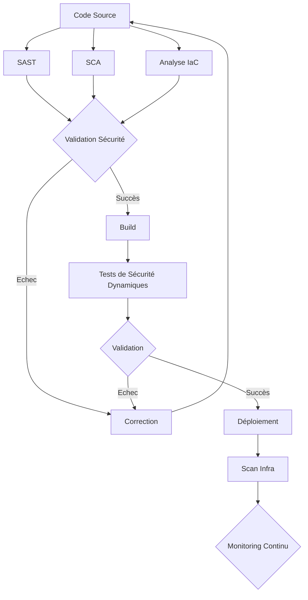
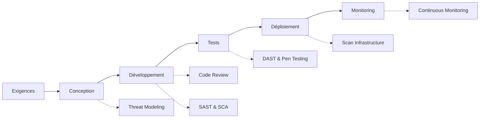
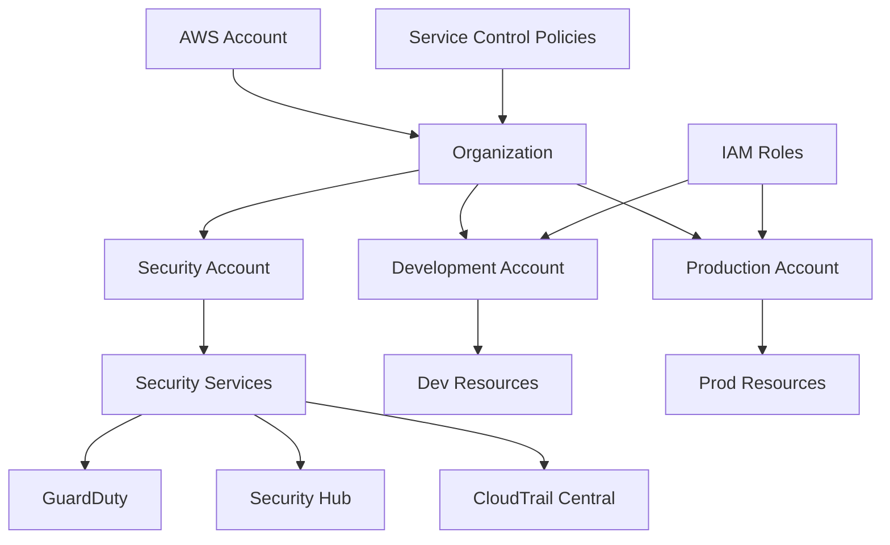

# 🔒 Tests de Sécurité

## Introduction

Les tests de sécurité sont cruciaux pour garantir que l'infrastructure AccessWeaver et ses applications sont protégées contre les menaces. Cette documentation détaille notre approche complète des tests de sécurité, méthodologies et bonnes pratiques.

---

## Principes des Tests de Sécurité

### Objectifs

- **Identifier les vulnérabilités** dans l'infrastructure et le code
- **Vérifier la conformité** aux standards de sécurité
- **Valider les contrôles** de sécurité implémentés
- **Réduire la surface d'attaque** du système
- **Protéger les données sensibles** des utilisateurs et du système

### Principes Directeurs

1. **Security by Design** - La sécurité doit être intégrée dès la conception
2. **Defense in Depth** - Multiple couches de sécurité superposées
3. **Least Privilege** - Accès minimal nécessaire pour chaque composant
4. **Fail Secure** - En cas d'échec, le système doit rester sécurisé
5. **Regular Testing** - Tests de sécurité continus et réguliers

---

## Types de Tests de Sécurité

### 1. Analyse Statique de Sécurité (SAST)

| Description | Outils | Fréquence |
|-------------|--------|------------|
| Analyse du code source pour détecter les vulnérabilités | SonarQube, Checkmarx, SpotBugs | À chaque commit |

#### Principales vérifications

- Injection (SQL, NoSQL, LDAP, etc.)
- Gestion des authentifications et sessions
- Exposition de données sensibles
- Contrôle d'accès défaillant
- Mauvaise configuration de sécurité
- Cross-Site Scripting (XSS) et Cross-Site Request Forgery (CSRF)

### 2. Analyse de Configuration IaC

| Description | Outils | Fréquence |
|-------------|--------|------------|
| Analyse des fichiers Terraform et CloudFormation | tfsec, Checkov, cfn_nag | À chaque PR |

#### Principales vérifications

- Ressources publiquement accessibles
- Chiffrement manquant ou faible
- Politiques IAM trop permissives
- Manque de journalisation ou monitoring
- Configuration réseau non sécurisée
- Secrets en clair

### 3. Analyse des Dépendances (SCA)

| Description | Outils | Fréquence |
|-------------|--------|------------|
| Détection des vulnérabilités dans les dépendances | OWASP Dependency-Check, Snyk, Trivy | Quotidien |

#### Principales vérifications

- Dépendances avec CVE connues
- Licences problématiques
- Versions obsolètes ou non maintenues
- Dépendances transitives vulnérables

### 4. Tests de Pénétration

| Description | Outils/Méthodes | Fréquence |
|-------------|-----------------|------------|
| Simulation d'attaques sur le système | Outils manuels + automatisés (Metasploit, OWASP ZAP, Burp Suite) | Trimestriel |

#### Types de Tests de Pénétration

- **Black Box** - Sans connaissance préalable du système
- **White Box** - Avec accès complet au code et à la documentation
- **Gray Box** - Avec connaissance partielle du système

### 5. Scan de Vulnérabilités d'Infrastructure

| Description | Outils | Fréquence |
|-------------|--------|------------|
| Détection des vulnérabilités dans l'infrastructure déployée | Nessus, OpenVAS, AWS Inspector | Hebdomadaire |

#### Cibles

- Systèmes d'exploitation et patches
- Services exposés
- Configurations des bases de données
- Configuration des conteneurs
- Sécurité du réseau

### 6. Tests de Sécurité des API

| Description | Outils | Fréquence |
|-------------|--------|------------|
| Vérification de la sécurité des API REST et GraphQL | OWASP ZAP API Scan, Postman | À chaque release |

#### Vérifications clés

- Authentification et autorisation
- Rate limiting et protection DoS
- Validation des entrées
- Gestion des erreurs sécurisée
- Protection OWASP API Top 10

---

## Outils et Technologies

### Outils de Sécurité Infrastructure

- **[AWS Config](https://aws.amazon.com/config/)** - Audit de configuration AWS
- **[AWS Security Hub](https://aws.amazon.com/security-hub/)** - Centre de sécurité centralisé
- **[AWS GuardDuty](https://aws.amazon.com/guardduty/)** - Détection de menaces
- **[AWS Inspector](https://aws.amazon.com/inspector/)** - Évaluation de vulnérabilités
- **[Prowler](https://github.com/prowler-cloud/prowler)** - Audit de sécurité AWS

### Outils d'Analyse Statique et Dynamique

- **[SonarQube](https://www.sonarqube.org/)** - Analyse statique de code
- **[Checkmarx](https://www.checkmarx.com/)** - SAST et DAST
- **[OWASP ZAP](https://www.zaproxy.org/)** - Tests dynamiques de sécurité
- **[Burp Suite](https://portswigger.net/burp)** - Tests de sécurité d'applications web
- **[tfsec](https://github.com/aquasecurity/tfsec)** - Analyse sécurité Terraform

### Outils de Scan de Dépendances

- **[Snyk](https://snyk.io/)** - Sécurité des dépendances
- **[OWASP Dependency-Check](https://owasp.org/www-project-dependency-check/)** - Analyse de dépendances
- **[Trivy](https://github.com/aquasecurity/trivy)** - Scanner pour containers et applications
- **[Dependabot](https://github.com/dependabot)** - Mises à jour automatisées

---

## Mise en Œuvre

### Intégration dans le CI/CD



### Exemple de Pipeline de Sécurité

```yaml
# .jenkins/pipelines/security-tests.yml
pipeline:
  stages:
    - name: "Static Analysis"
      steps:
        - checkout
        - run_sonarqube
        - run_tfsec
        - run_dependency_check
        
    - name: "Build if Secure"
      steps:
        - validate_security_results
        - build_artifacts
        
    - name: "Dynamic Testing"
      steps:
        - deploy_to_test
        - run_zap_scan
        - run_api_security_tests
        
    - name: "Infrastructure Scanning"
      steps:
        - run_prowler
        - run_aws_inspector
        
    - name: "Security Report"
      steps:
        - generate_security_report
        - publish_findings
        - notify_security_team
```

---

## Processus de Test de Sécurité

### 1. Sécurité dans le Cycle de Développement



### 2. Processus de Correction (Remediation)

1. **Identification** - Détection des vulnérabilités
2. **Classification** - Évaluation de la sévérité (CVSS)
3. **Priorisation** - Détermination de l'ordre de correction
4. **Correction** - Résolution des vulnérabilités
5. **Vérification** - Confirmation de la correction
6. **Documentation** - Enregistrement des actions prises

### 3. Gestion des Vulnérabilités

| Sévérité | Délai de Correction | Action |
|-------------|----------------------|----------|
| **Critique** | 24-48 heures | Correction immédiate, possibilité de désactivation temporaire |
| **Élevée** | 1 semaine | Correction prioritaire dans le prochain sprint |
| **Moyenne** | 2-4 semaines | Planifiée dans un sprint prochain |
| **Faible** | 1-3 mois | Incluse dans la roadmap de maintenance |

---

## Sécurité spécifique à AWS

### Services AWS de Sécurité Utilisés

- **AWS IAM** - Gestion des identités et accès
- **AWS KMS** - Gestion des clés de chiffrement
- **AWS WAF** - Pare-feu d'application web
- **AWS Shield** - Protection DDoS
- **AWS Config** - Évaluation de conformité
- **CloudTrail** - Journalisation des API
- **VPC Flow Logs** - Surveillance du trafic réseau
- **AWS Secrets Manager** - Gestion des secrets

### Modèle de Sécurité AWS



### Tests de Sécurité AWS

- **Tests de configuration VPC** - Sécurité des réseaux et sous-réseaux
- **Tests IAM** - Validations des politiques et rôles
- **Tests de chiffrement** - Vérification du chiffrement des données
- **Tests de sécurité S3** - Configuration des buckets
- **Tests de sécurité RDS** - Protection des bases de données
- **Tests de sécurité des containers** - Sécurité ECS/EKS

---

## Bonnes Pratiques

### Sécurité Infrastructure as Code

- **Isolation des environnements** - Séparation stricte dev/prod
- **Pas de secrets dans le code** - Utilisation de gestionnaires de secrets
- **Principe de moindre privilège** - Permissions minimales nécessaires
- **Chiffrement partout** - Données au repos et en transit
- **Journalisation et monitoring** - Audit trails complets
- **Infrastructure immuable** - Pas de modifications manuelles

### Sécurité Java 21

- **Updates réguliers** - Maintenir Java 21 avec les derniers correctifs
- **Sécurisation JVM** - Configuration appropriée
- **Utilisation des fonctionnalités sécurité modernes** - Records, sealed classes
- **Sécurité des APIs** - Validation des entrées et sanitisation
- **Cryptographie moderne** - Utilisation des API sécurisées

```java
// Exemple de code sécurisé Java 21
// Utilisation des records pour l'immutabilité
public record UserCredential(String username, char[] password) {
    public UserCredential {
        Objects.requireNonNull(username, "Username cannot be null");
        Objects.requireNonNull(password, "Password cannot be null");
        if (username.trim().isEmpty()) {
            throw new IllegalArgumentException("Username cannot be empty");
        }
        if (password.length < 8) {
            throw new IllegalArgumentException("Password too short");
        }
    }
    
    // Méthode sécurisée pour effacer le mot de passe de la mémoire
    public void clearPassword() {
        Arrays.fill(password, '\0');
    }
}

// Utilisation de pattern matching sécurisé
public void processInput(Object input) {
    switch (input) {
        case String s when s.matches("^[a-zA-Z0-9]+$") -> processValidString(s);
        case Integer i when i > 0 -> processPositiveInteger(i);
        case null, default -> throw new SecurityException("Invalid input type");
    }
}
```

---

## Surveillance et Reporting

### Métriques de Sécurité

- **Nombre de vulnérabilités** par sévérité
- **Temps moyen de correction** par type de vulnérabilité
- **Dette de sécurité** - Vulnérabilités non corrigées pondérées
- **Couverture des tests de sécurité** - % du code/infra testé
- **Taux de faux positifs** - Précision des outils

### Rapports de Sécurité

- **Rapport Hebdomadaire** - Résumé des scans réguliers
- **Rapport Mensuel** - Tendances et analyses
- **Rapport Trimestriel** - Revue approfondie avec pentests
- **Rapport d'Incident** - Analyse après incident de sécurité

---

## Conformité et Certification

### Standards de Sécurité

- **[OWASP Top 10](https://owasp.org/www-project-top-ten/)** - Vulnérabilités web critiques
- **[OWASP ASVS](https://owasp.org/www-project-application-security-verification-standard/)** - Standard de vérification
- **[CIS Benchmarks](https://www.cisecurity.org/cis-benchmarks/)** - Sécurité infrastructure
- **[NIST Cybersecurity Framework](https://www.nist.gov/cyberframework)** - Framework global

### Certifications Visées

- **ISO 27001** - Sécurité de l'information
- **SOC 2 Type II** - Contrôles organisationnels
- **GDPR** - Protection des données en Europe
- **Cloud Security Alliance (CSA)** - Sécurité cloud

---

## Ressources

- [AWS Security Documentation](https://docs.aws.amazon.com/security/)
- [OWASP Testing Guide](https://owasp.org/www-project-web-security-testing-guide/)
- [NIST Special Publication 800-53](https://nvlpubs.nist.gov/nistpubs/SpecialPublications/NIST.SP.800-53r5.pdf)
- [CIS AWS Foundations Benchmark](https://www.cisecurity.org/benchmark/amazon_web_services/)
- [Java Security Best Practices](https://www.oracle.com/java/technologies/javase/seccodeguide.html)